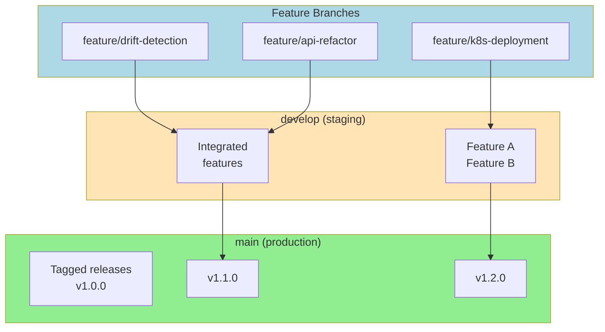
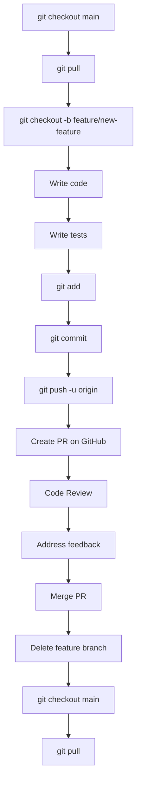
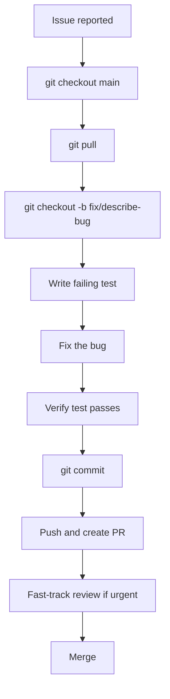
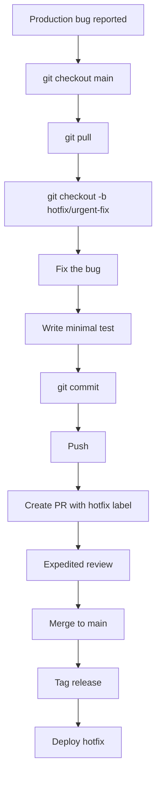
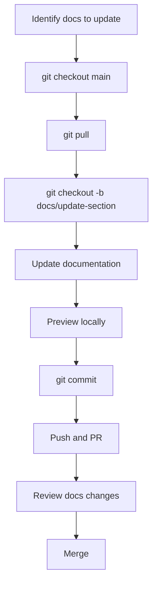
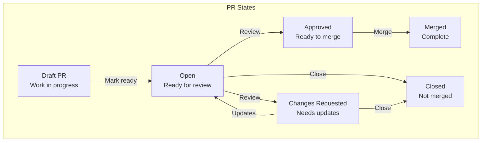
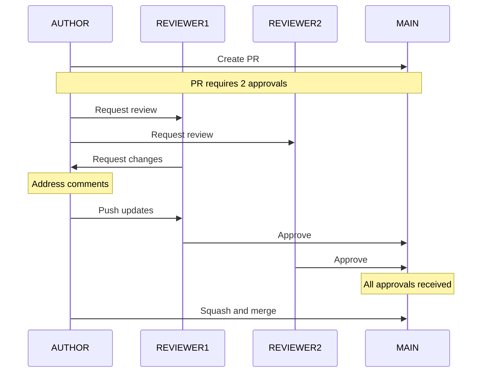
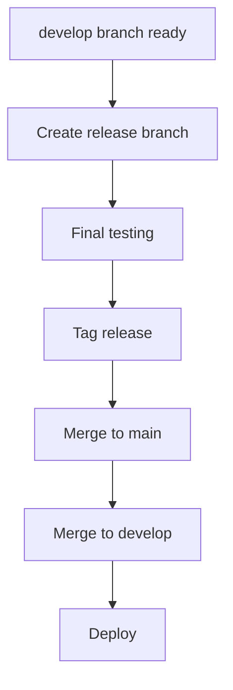
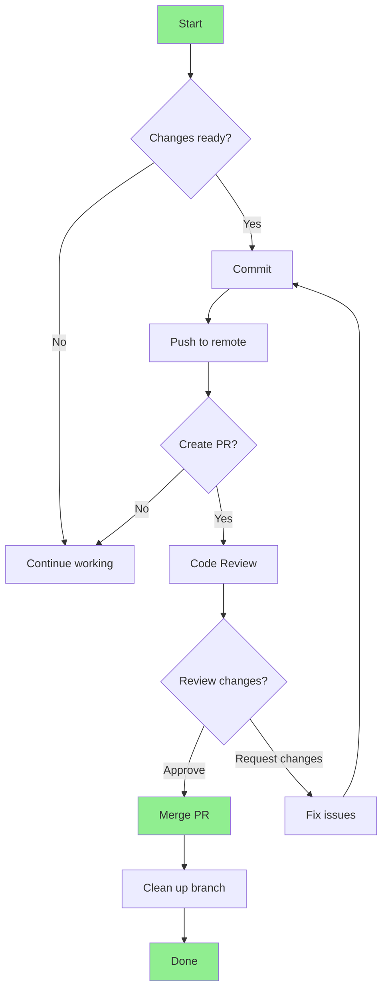

# Git Workflow Guide

Complete workflow guide for contributing to the MLOps Weather Classification System.

---

## Branch Strategy



---

## Branch Naming Convention

### Format

```
<type>/<short-description>

Examples:
- feature/add-drift-detection
- fix/api-timeout-error
- docs/update-readme
- refactor/extract-features-module
- test/add-drift-scenarios
- chore/update-dependencies
```

### Type Prefixes

| Prefix | Purpose | Example |
|--------|---------|---------|
| `feature/` | New features | `feature/add-mlflow-tracking` |
| `fix/` | Bug fixes | `fix/correct-glcm-calculation` |
| `docs/` | Documentation | `docs/add-api-reference` |
| `refactor/` | Code refactoring | `refactor/clean-api-code` |
| `test/` | Test additions | `test/add-integration-tests` |
| `chore/` | Maintenance | `chore/update-requirements` |
| `hotfix/` | Urgent production fixes | `hotfix/security-patch` |

---

## Commit Message Convention

### Format

```
<type>(<scope>): <subject>

<body>

<footer>
```

### Examples

**Good commit messages:**

```
feat(api): add prediction logging to database

- Log timestamp, features, prediction, and confidence
- Store features as JSONB for drift analysis
- Add processing_time_ms metric

Closes #42
```

```
fix(drift): correct PSI calculation for zero values

When actual percentage is 0, skip the term instead of
causing division by zero error.

Fixes #38
```

```
docs(readme): update installation instructions

- Add Docker Desktop requirement
- Fix incorrect path references
- Add troubleshooting section
```

**Bad commit messages:**

```
fixed stuff
update
wip
asdfasdf
```

### Commit Types

| Type | Description |
|------|-------------|
| `feat` | New feature for the user |
| `fix` | Bug fix for the user |
| `docs` | Documentation only changes |
| `style` | Formatting, no code change |
| `refactor` | Code change, no feature/fix |
| `perf` | Performance improvement |
| `test` | Adding tests |
| `chore` | Build, CI, dependencies |
| `revert` | Revert previous commit |

---

## Complete Workflow

### Step 1: Start Fresh

```bash
# Ensure main is up to date
git checkout main
git pull origin main

# Create and switch to new branch
git checkout -b feature/your-feature-name
```

### Step 2: Make Changes

```bash
# Make your code changes
# ...

# Check what changed
git status
git diff

# Stage changes
git add path/to/changed/file.py
git add path/to/another/file.md

# Or stage all
git add .

# Commit with descriptive message
git commit -m "feat(scope): descriptive subject

- Bullet point 1
- Bullet point 2

Closes #123"
```

### Step 3: Keep Branch Updated

```bash
# While working, periodically rebase on main
git fetch origin
git rebase origin/main

# Resolve conflicts if any
# After resolving, continue rebase
git rebase --continue
```

### Step 4: Push Branch

```bash
# First push (sets upstream)
git push -u origin feature/your-feature-name

# Subsequent pushes
git push
```

### Step 5: Create Pull Request

1. Go to GitHub repository
2. Click "Compare & pull request"
3. Fill in PR template
4. Request reviewers
5. Submit PR

### Step 6: Code Review

- Address reviewer comments
- Push updates
- Request re-review if needed

### Step 7: Merge

```bash
# Squash and merge (recommended)
# Or merge commit
# Delete branch after merge
```

---

## Workflows by Scenario

### Scenario 1: Adding a New Feature



**Commands:**
```bash
# 1. Start fresh
git checkout main && git pull

# 2. Create feature branch
git checkout -b feature/add-monitoring-dashboard

# 3. Make changes
# ... edit files ...

# 4. Commit
git add .
git commit -m "feat(monitoring): add Prometheus metrics dashboard

- Add /metrics endpoint
- Implement request count metrics
- Add latency histogram

Closes #15"

# 5. Push
git push -u origin feature/add-monitoring-dashboard

# 6. Create PR on GitHub
```

---

### Scenario 2: Bug Fix



**Commands:**
```bash
# 1. Start fresh
git checkout main && git pull

# 2. Create fix branch
git checkout -b fix/api-timeout-error

# 3. Write test first (TDD)
# ... write test that reproduces bug ...

# 4. Fix the bug
# ... make the fix ...

# 5. Commit
git add .
git commit -m "fix(api): resolve timeout error on large images

- Increase timeout from 30s to 120s
- Add streaming for large file uploads
- Add timeout configuration option

Fixes #28"

# 6. Push
git push -u origin fix/api-timeout-error

# 7. Create PR
```

---

### Scenario 3: Hotfix (Urgent Production Fix)



**Commands:**
```bash
# 1. Create hotfix branch from main
git checkout main && git pull
git checkout -b hotfix/security-patch

# 2. Make urgent fix
# ... critical fix ...

# 3. Commit with HOTFIX prefix
git add .
git commit -m "HOTFIX: security vulnerability in API authentication

- Fix JWT token validation
- Add token expiration check
- Update secret key handling

P0 - Immediate merge required"

# 4. Push immediately
git push -u origin hotfix/security-patch

# 5. Create PR, expedite review
# 6. Merge ASAP
```

---

### Scenario 4: Documentation Update



**Commands:**
```bash
# 1. Create docs branch
git checkout main && git pull
git checkout -b docs/add-api-reference

# 2. Update docs
# ... edit .md files ...

# 3. Commit
git add .
git commit -m "docs(api): add complete API reference documentation

- Document all endpoints
- Add request/response examples
- Include error codes
- Add usage examples"

# 4. Push
git push -u origin docs/add-api-reference
```

---

## Pull Request Workflow

### PR States



### PR Review Process



### PR Checklist

Before requesting review:

- [ ] Code follows style guidelines
- [ ] Tests pass locally
- [ ] Documentation updated
- [ ] No console.log/debug statements
- [ ] Branch is rebased on main
- [ ] PR description complete
- [ ] Related issue linked

Before merging:

- [ ] All comments resolved
- [ ] Required approvals obtained
- [ ] CI/CD pipeline passing
- [ ] No conflicts with main
- [ ] Branch tested in staging

---

## Handling Conflicts

### During Rebase

```bash
# Start rebase
git fetch origin
git rebase origin/main

# Git pauses at conflict
# Edit conflicted files to resolve

# Stage resolved files
git add path/to/conflicted/file.py

# Continue rebase
git rebase --continue

# Or abort if needed
git rebase --abort
```

### During Merge

```bash
# Attempt merge
git checkout develop
git merge feature/your-branch

# Resolve conflicts
# Edit conflicted files

git add .
git commit -m "Merge branch 'feature/your-branch'

Resolved conflicts:
- src/api/index.py
- tests/test_api.py"
```

---

## Tags and Releases

### Tagging

```bash
# Create annotated tag
git checkout main
git pull
git tag -a v1.0.0 -m "Release version 1.0.0

Features:
- Weather classification API
- Drift detection
- Gradio demo

Closes #1 through #25"

# Push tag
git push origin v1.0.0
```

### Release Flow



---

## Useful Commands

### Daily Workflow

```bash
# Check current status
git status

# See changes
git diff

# See staged changes
git diff --cached

# Commit with auto-staging
git commit -am "message"

# Undo last commit (keep changes)
git reset HEAD~1

# Undo last commit (discard changes)
git reset --hard HEAD~1

# Amend last commit
git commit --amend

# Stash changes
git stash
git stash pop

# See commits
git log --oneline -10
```

### Branching

```bash
# List branches
git branch

# List all branches
git branch -a

# Switch branch
git checkout branch-name

# Create and switch
git checkout -b new-branch

# Delete local branch
git branch -d branch-name

# Delete remote branch
git push origin --delete branch-name

# Rename branch
git branch -m old-name new-name
```

### Remote

```bash
# Fetch updates
git fetch

# Pull updates
git pull

# Pull with rebase
git pull --rebase origin main

# Push
git push

# Push tags
git push --tags
```

---

## Quick Reference

### Complete Feature Workflow

```bash
# 1. Start
git checkout main && git pull
git checkout -b feature/my-feature

# 2. Work
# ... make changes ...
git add .
git commit -m "feat(scope): description"

# 3. Update
git fetch origin
git rebase origin/main

# 4. Push
git push -u origin feature/my-feature

# 5. After merge
git checkout main && git pull
git branch -d feature/my-feature
```

### Emergency Fix Workflow

```bash
# 1. Start from main
git checkout main && git pull
git checkout -b hotfix/urgent-fix

# 2. Fix
# ... urgent changes ...
git add .
git commit -m "HOTFIX: urgent description"

# 3. Push and fast-track PR
git push -u origin hotfix/urgent-fix
```

---

## Diagram Summary



---

## Team Rules

1. **Never commit directly to main**
2. **Always create a branch for changes**
3. **Write meaningful commit messages**
4. **Keep branches up to date**
5. **Request review before merging**
6. **Delete branches after merge**
7. **Use Hotfix for production bugs**

---

Created for NT114 - MLOps Architecture Project
Department: Computer Networks and Data Communications
