# System Architecture

Detailed architecture documentation for the MLOps Weather Classification System.

---

## High-Level Architecture

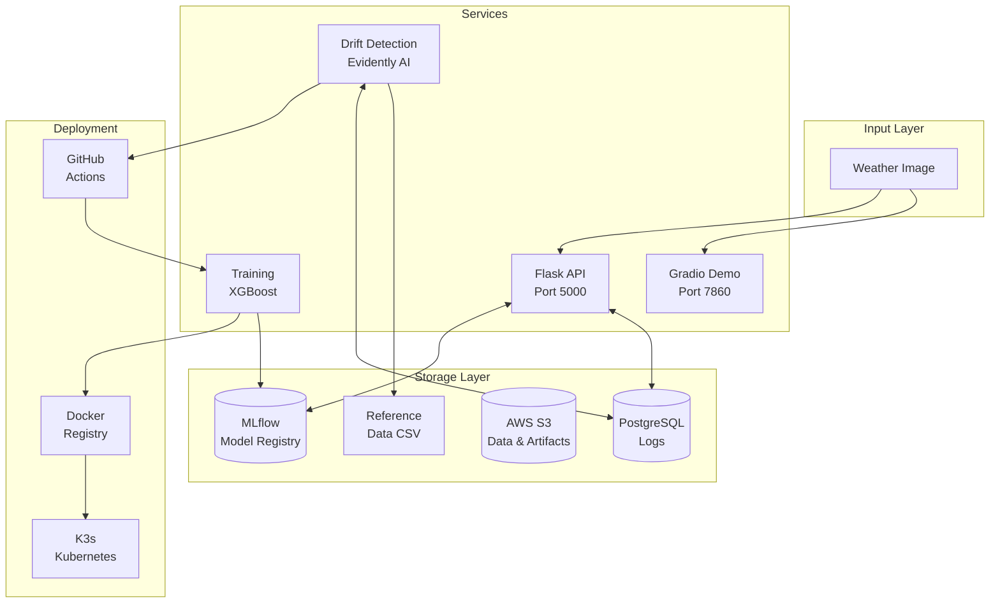

---

## Component Architecture

### 1. API Layer

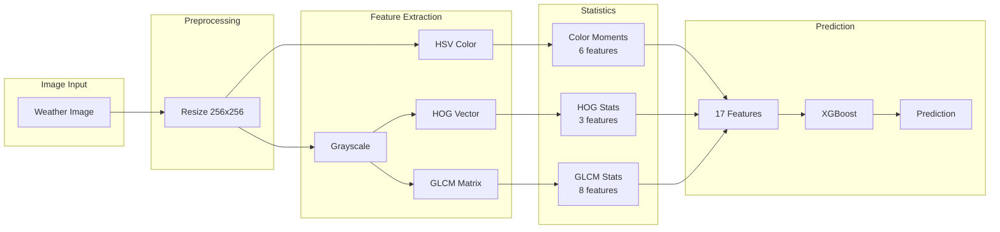

---

### 2. Training Pipeline

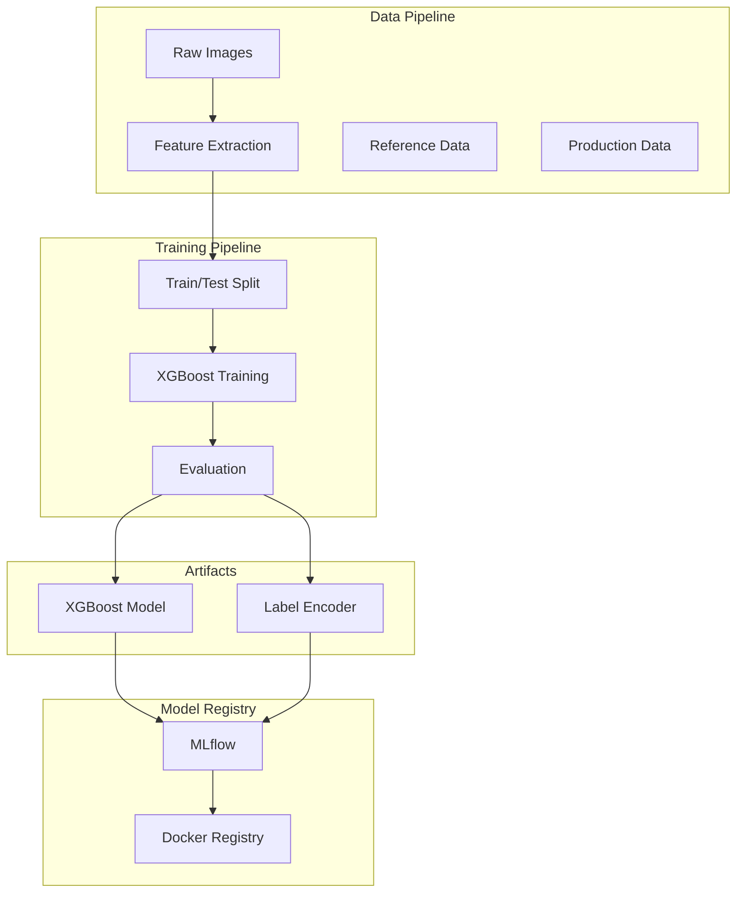

---

### 3. Drift Detection

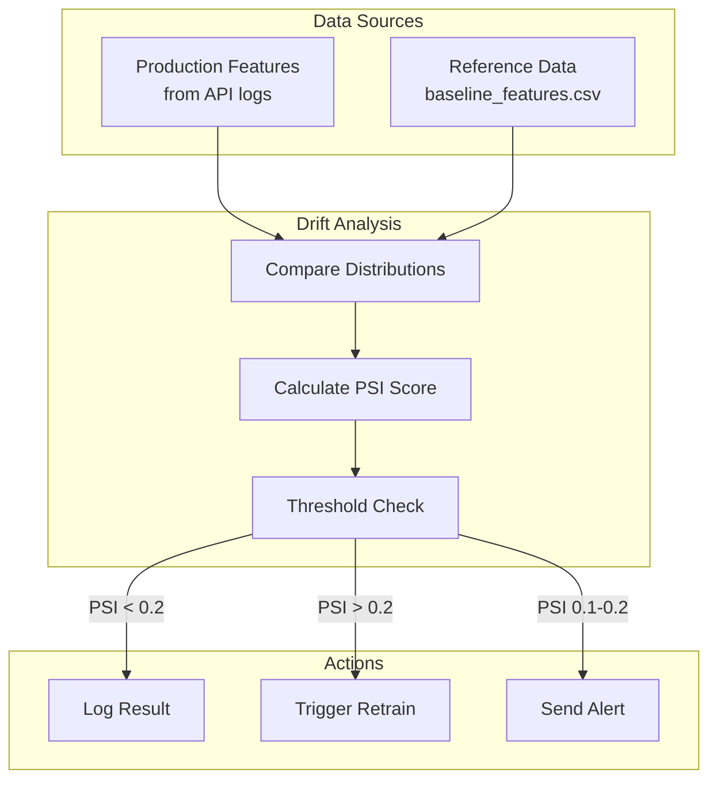

---

## Data Flow

### Prediction Flow

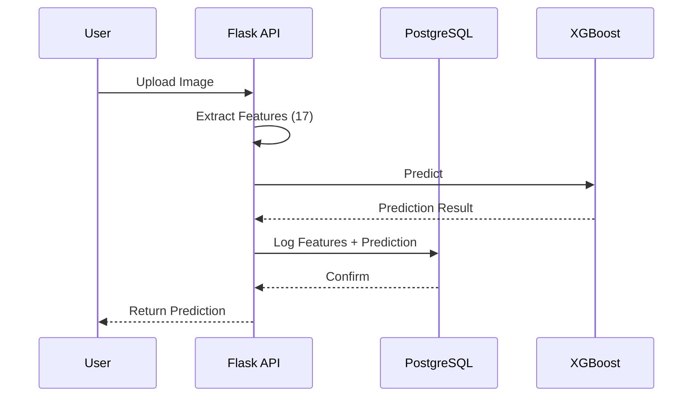

### Retraining Flow

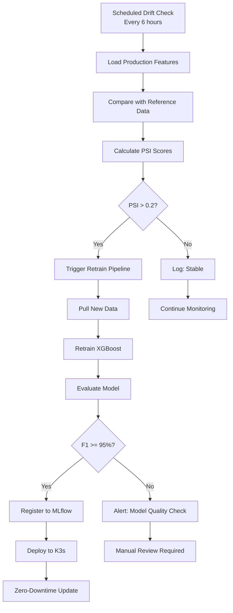

---

## Database Schema

### Predictions Table

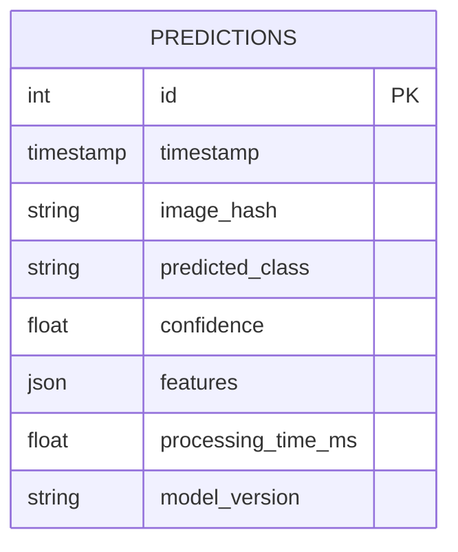

### Drift Logs Table

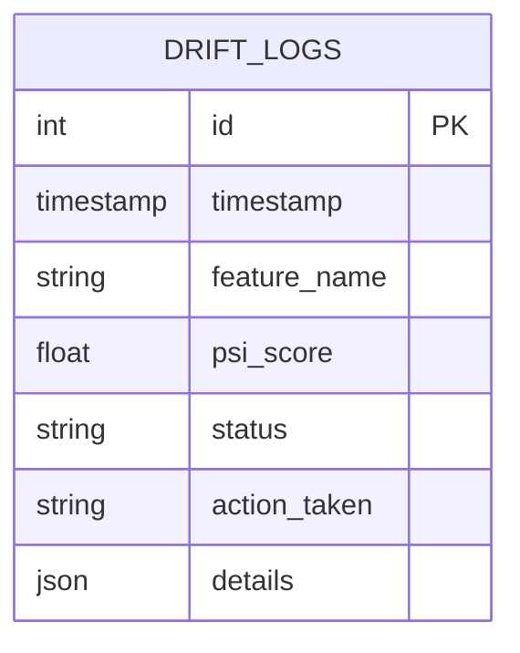

---

## Kubernetes Deployment

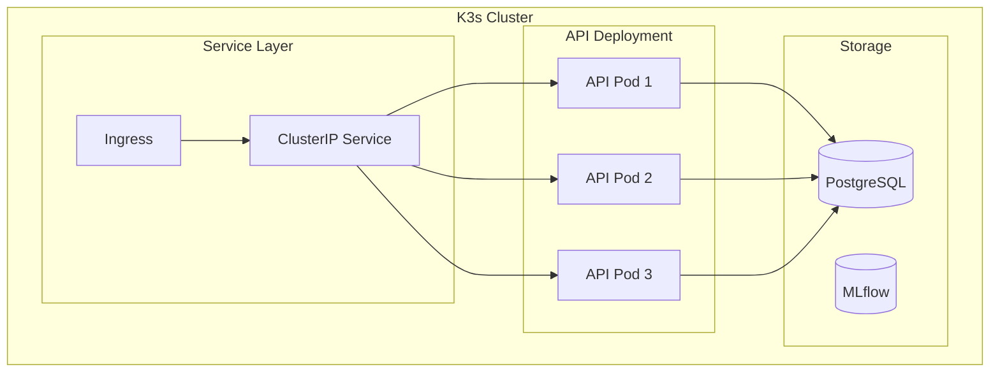

### Rolling Update Strategy

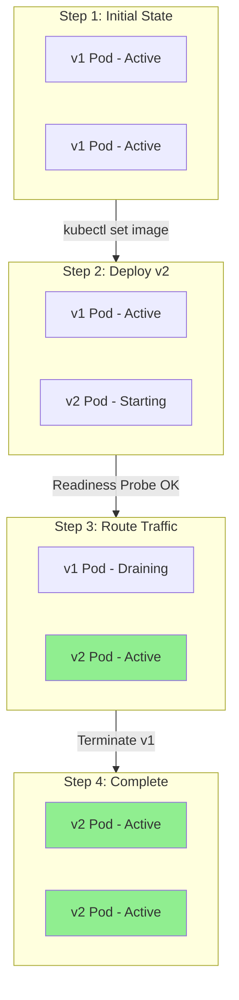

---

## CI/CD Pipeline

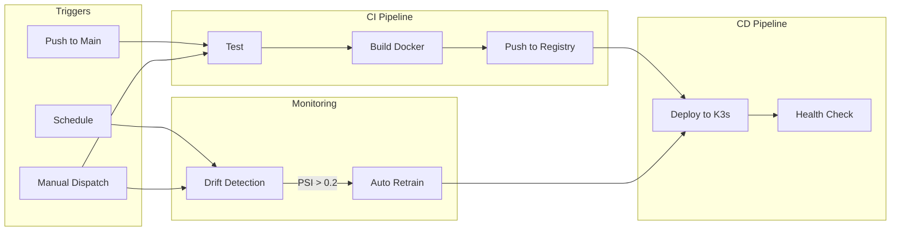

---

## Infrastructure

### AWS Resources

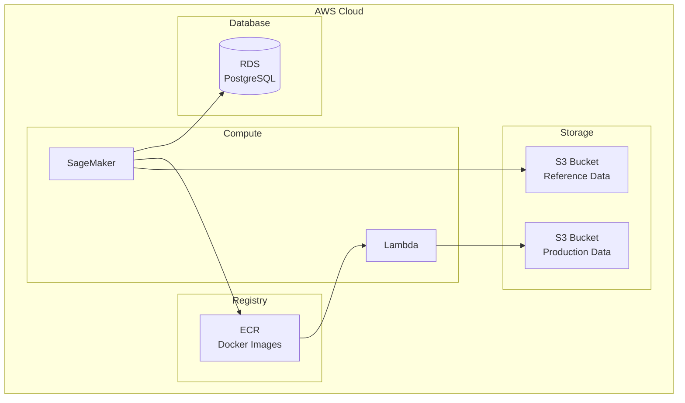

---

## Monitoring Stack

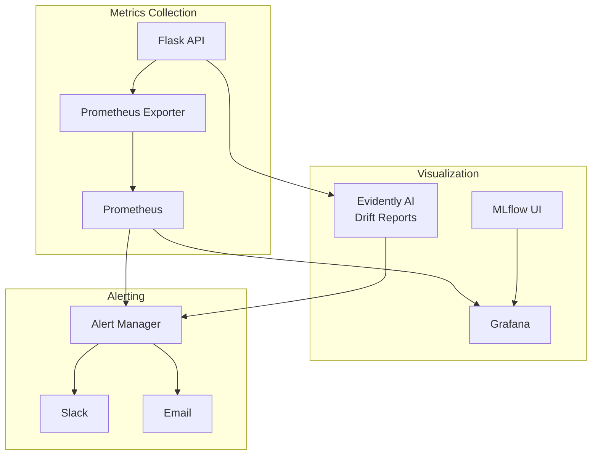

---

## Security

### Secrets Management

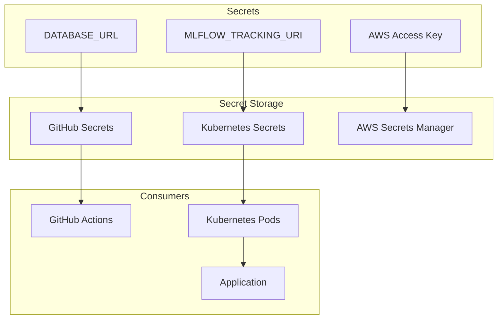

---

## Scalability

### Horizontal Pod Autoscaling

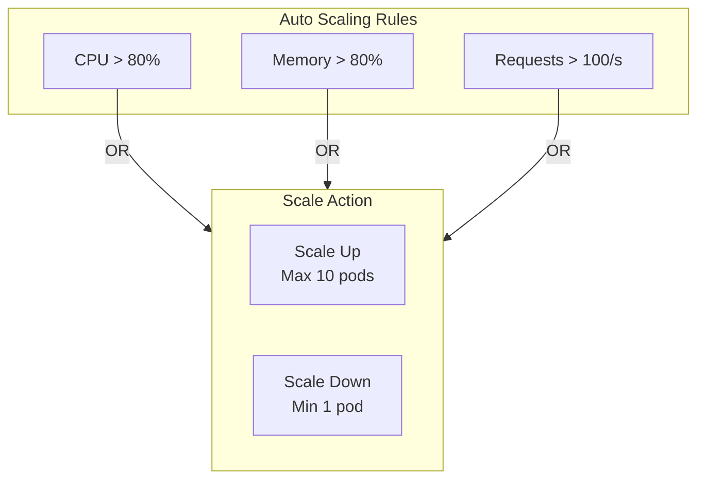

---

## Performance Targets

| Metric | Target | Current |
|--------|--------|---------|
| API Latency (P95) | < 500ms | - |
| Throughput | 100 req/sec | - |
| Model Load Time | < 5s | - |
| Drift Detection | < 60s | - |
| MTTR | < 30 min | - |
| Zero Downtime | 100% | - |

---

Created for NT114 - MLOps Architecture Project
Department: Computer Networks and Data Communications
