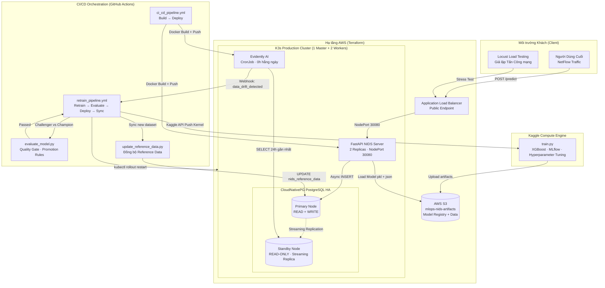
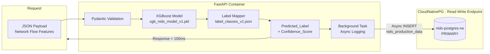
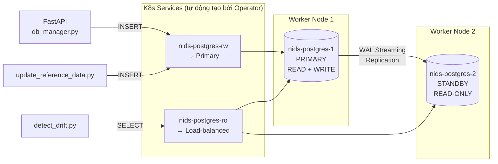
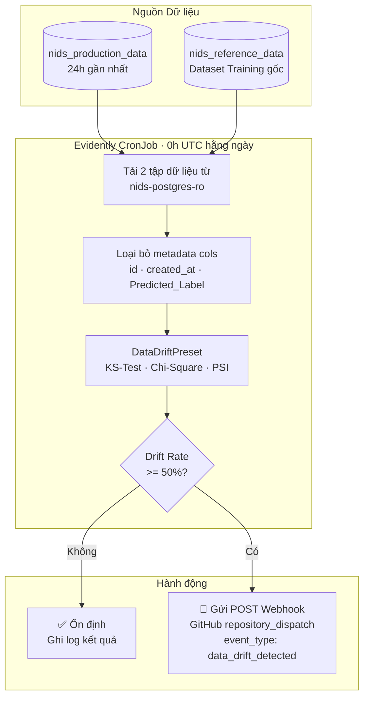
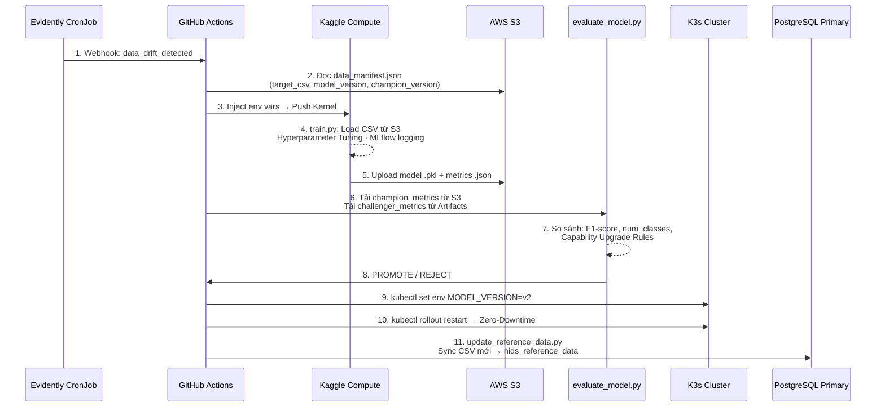
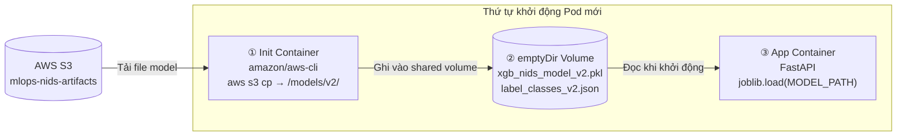
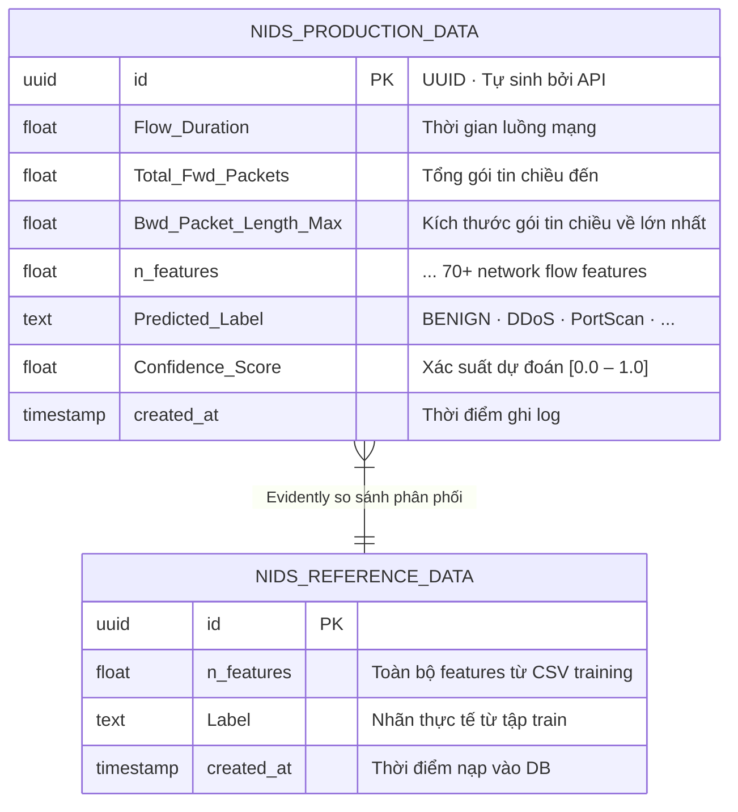

# Thiết kế Kiến trúc Hệ thống (System Architecture)

Tài liệu này đặc tả chi tiết kiến trúc của **Hệ thống MLOps Phát hiện Trôi Dữ liệu và Tái huấn luyện Tự động cho Mô hình Phát hiện Tấn công Mạng (NIDS)** dựa trên tập dữ liệu CIC-IDS2017.

---

## 1. Kiến trúc Tổng thể (High-Level Architecture)

Hệ thống được thiết kế theo vòng lặp khép kín **Closed-Loop MLOps**: Data → Inference → Monitor → Retrain → Deploy → Data.



---

## 2. Chi tiết Từng Thành phần

### 2.1. Lớp Suy diễn và Ghi log (Inference & Logging Layer)

Request được xử lý song song theo 2 nhánh: **Inference** (đồng bộ, trả kết quả ngay) và **Logging** (bất đồng bộ, không ảnh hưởng latency).



**File model được nạp từ emptyDir Volume** do Init Container kéo từ S3 mỗi khi Pod khởi động — không bao giờ baked vào Docker Image.

### 2.2. Lớp Cơ sở Dữ liệu HA (CloudNativePG)



Khi Primary Node sập, CloudNativePG Operator tự động **thăng cấp Standby** lên làm Primary mới trong vòng 30-60 giây.

### 2.3. Lớp Giám sát Drift (Evidently AI CronJob)



### 2.4. Lớp CI/CD Pipeline (GitHub Actions)

#### Pipeline 1: `ci_cd_pipeline.yml` — Code Deployment

Trigger khi có **code thay đổi** được push lên `main`.

```
Lint & Syntax Check → Build Docker Image (API + Monitor) → Push Docker Hub → Apply K8s Manifests → Rolling Update
```

#### Pipeline 2: `retrain_pipeline.yml` — Model Retraining

Trigger bởi **Webhook từ Evidently**, schedule hằng ngày, hoặc thủ công.



### 2.5. Cơ chế Zero-Downtime Deployment (Init Container)



K3s thực hiện Rolling Update: Pod cũ (v1) tiếp tục phục vụ traffic trong khi Pod mới (v2) đang init — không có downtime.

---

## 3. Lược đồ Cơ sở Dữ liệu (Database Schema)



`nids_reference_data` được **tự động cập nhật** sau mỗi lần retrain thành công bởi `update_reference_data.py` — đảm bảo Evidently luôn dùng dataset training mới nhất làm baseline.

---

## 4. Hạ tầng AWS (Terraform)

```
ap-southeast-1 (Singapore)
├── VPC: 10.0.0.0/16
│   ├── Public Subnet 1a (10.0.1.0/24) — Master Node · NAT Gateway
│   ├── Public Subnet 1b (10.0.3.0/24) — ALB (Multi-AZ)
│   └── Private Subnet 1a (10.0.2.0/24) — Worker Nodes
│
├── EC2 Instances
│   ├── ip-10-0-1-219  · t3.medium · K3s Master (control-plane)
│   ├── ip-10-0-2-244  · t3.medium · K3s Worker 1 + Postgres PRIMARY
│   └── ip-10-0-2-8    · t3.medium · K3s Worker 2 + Postgres STANDBY
│
├── Application Load Balancer (mlops-api-lb)
│   └── Listener :80 → Target Group → Worker NodePort 30080
│
└── S3 Bucket: mlops-nids-artifacts
    ├── models/v1/  ← xgb_nids_model_v1.pkl · label_classes_v1.json · metrics_v1.json
    ├── models/v2/  ← xgb_nids_model_v2.pkl · label_classes_v2.json · metrics_v2.json
    ├── training-data/  ← train_2_classes.csv · train_3_classes.csv
    └── data_manifest.json  ← "Nguồn Sự thật" về dataset hiện tại
```

---

## 5. Mục tiêu Hiệu năng (Performance SLA)

| Chỉ số                   | Mục tiêu                   | Cơ chế đạt được                         |
| ------------------------ | -------------------------- | --------------------------------------- |
| **Độ trễ API Inference** | < 100ms                    | Model cache trong RAM (emptyDir Volume) |
| **Bảo toàn Dữ liệu**     | 100% requests được ghi log | Async Background Task trong FastAPI     |
| **Downtime khi Deploy**  | 0%                         | Rolling Update + Init Container         |
| **Phục hồi DB khi sập**  | < 60 giây                  | CloudNativePG Auto Failover             |
| **Chu kỳ Retrain**       | < 2 giờ                    | Kaggle GPU/CPU → S3 → K3s               |
| **Phát hiện Drift**      | Hằng ngày 0h UTC           | Evidently CronJob                       |

---

_Last updated: April 2026 — MLOps NIDS System Project_
