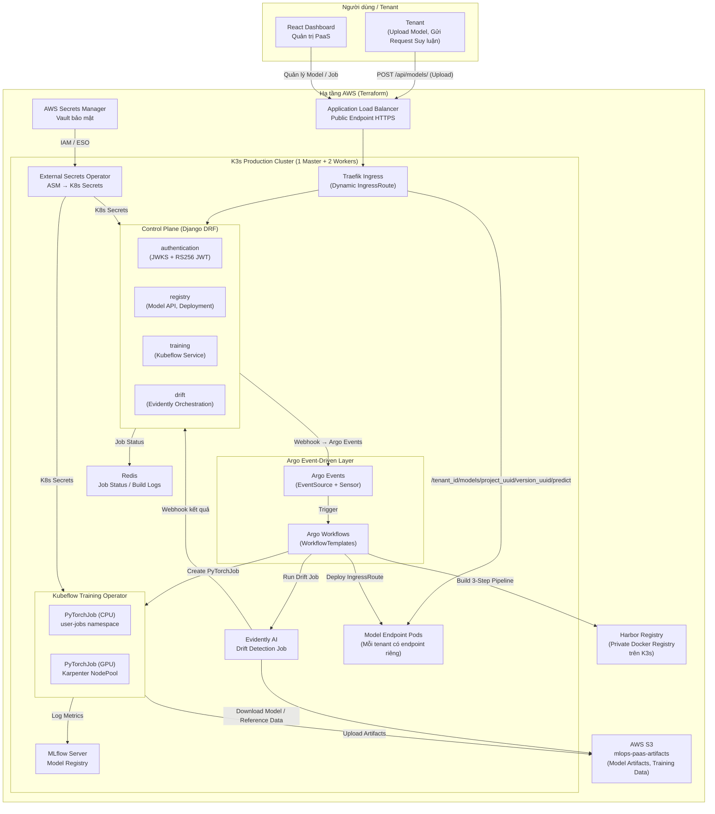
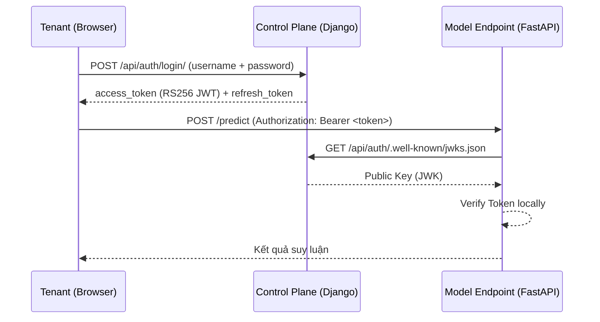
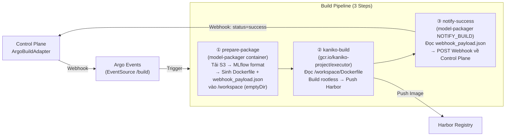
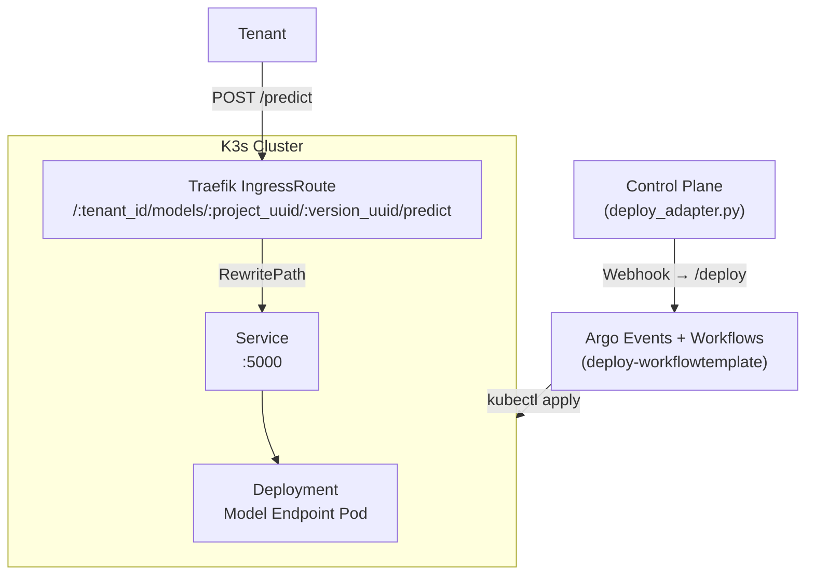
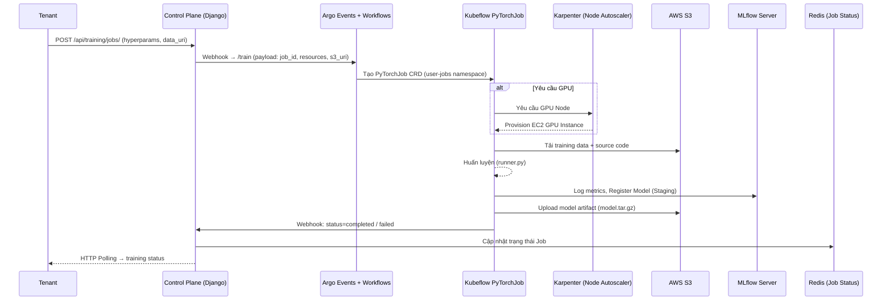
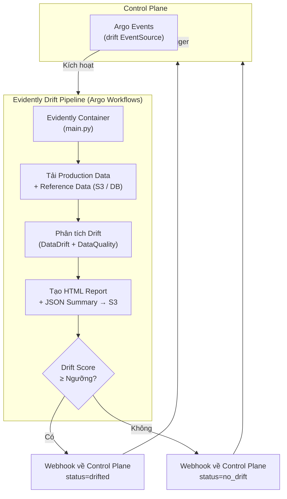
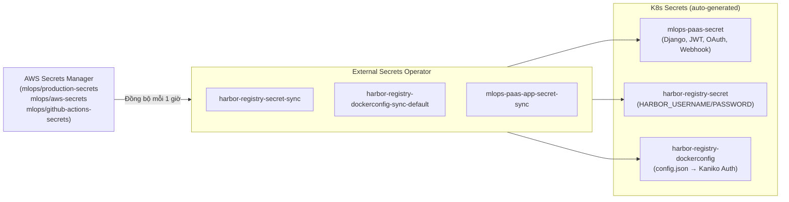
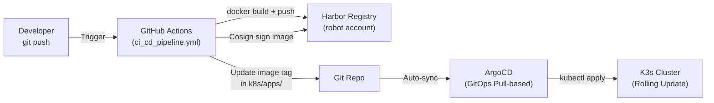
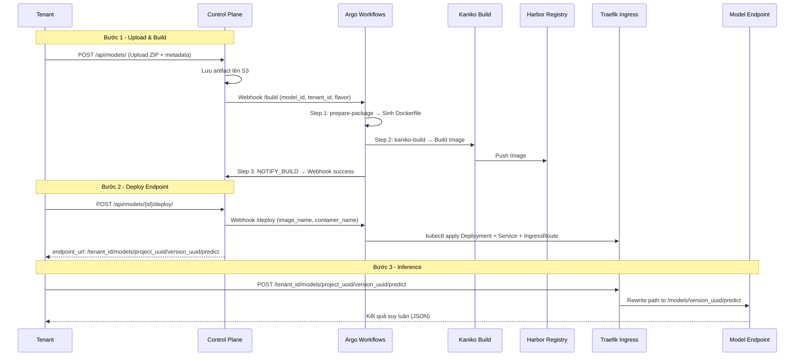

# Thiết kế Kiến trúc Hệ thống (System Architecture)

Tài liệu này đặc tả chi tiết kiến trúc của **MLOps AI PaaS - Nền tảng Quản lý Vòng đời Mô hình AI Đa Người thuê (Multi-Tenant)** phục vụ bài toán Phát hiện Tấn công Mạng (NIDS) dựa trên tập dữ liệu CIC-IDS2017.

---

## 1. Kiến trúc Tổng thể (High-Level Architecture)

Hệ thống hoạt động như một **AI PaaS** với hai mặt phẳng điều phối tách biệt:

- **Control Plane** - Django DRF xử lý API, xác thực đa người thuê (Asymmetric JWT RS256), quản lý vòng đời mô hình và điều phối Argo Workflows.
- **Data Plane** - Các tiến trình nền: Build Image (Kaniko), Deploy Endpoint, Training (Kubeflow), Drift Detection (Evidently AI).



---

## 2. Chi tiết Từng Thành phần

### 2.1. Lớp Xác thực Đa Người thuê (Multi-Tenant Authentication)

Hệ thống sử dụng **Asymmetric RS256 JWT** để xác thực. Access Token được ký bằng Private Key và xác thực bằng Public Key qua chuẩn JWKS - đảm bảo các service khác (Model Endpoints) có thể xác thực Token mà không cần truy cập Control Plane.



**Kiến trúc cô lập dữ liệu (Multi-Tenant Isolation):**

- Mỗi Tenant có `tenant_id` duy nhất được nhúng vào JWT Payload.
- Tất cả query Django đều tự động lọc theo `request.tenant` - không tenant nào có thể truy cập tài nguyên của tenant khác.
- Resource Quota của Kubeflow được áp dụng theo namespace `user-jobs` để chống Noisy Neighbor.

---

### 2.2. Luồng Đóng gói Mô hình (Model Build & Package Flow)

#### Môi trường Local (Docker Compose)

Control Plane sử dụng **Docker SDK (docker-py)** để khởi tạo container `model-packager` với Docker Socket mount.

```
Control Plane (Django) → DockerBuildAdapter → docker run model-packager → Docker Daemon → Harbor Registry
```

#### Môi trường Production (K3s)

Control Plane sử dụng **ArgoBuildAdapter** để gửi Webhook tới Argo Events. Pipeline được thực thi theo 3 bước tuần tự (DAG Steps) qua volume dùng chung `emptyDir`:



---

### 2.3. Luồng Deploy Model Endpoint (Dynamic Routing)

Sau khi Build hoàn tất, Control Plane kích hoạt Argo Workflows để tự động tạo Kubernetes Deployment + Service + Traefik IngressRoute cho mỗi mô hình:



**Chiến lược cô lập:** Mỗi deployment có runtime riêng theo UUID. Traefik định tuyến qua model-server gateway, còn gateway kiểm tra tenant và resolve `version_uuid` tới endpoint khỏe mạnh.

---

### 2.4. Luồng Huấn luyện Mô hình (Training Orchestration)

Tenant gửi yêu cầu huấn luyện từ React Dashboard. Control Plane gửi Webhook tới Argo Events để kích hoạt `training-workflowtemplate`:



**Scale-to-Zero:** Sau khi Job hoàn tất, Karpenter tự động thu hồi GPU Node EC2 - chi phí tính theo thời gian thực tế sử dụng.

---

### 2.5. Luồng Giám sát Drift Dữ liệu (Data Drift Detection)



Tenant có thể lập lịch chạy Drift Detection theo định kỳ hoặc kích hoạt thủ công từ Dashboard. Kết quả (HTML Report, JSON Summary) được upload lên S3 và URL được đính kèm trong phản hồi webhook.

---

### 2.6. Lớp Secret Management (External Secrets Operator)



---

## 3. Lược đồ Cơ sở Dữ liệu (Database Schema Overview)

Hệ thống sử dụng **PostgreSQL** với Schema isolation theo module:

```
PostgreSQL (mlops_paas_db)
├── Schema: control_plane (Django ORM)
│   ├── identity_customuser        - Tài khoản và tenant boundary
│   ├── catalog_modelproject - Model workspace
│   ├── registry_modelversion      - Immutable registry versions
│   ├── training_trainingjob       - Training snapshots và execution state
│   ├── deployment_deployment      - Build, deployment và endpoint state
│   └── drift_driftmonitor         - Drift configuration và run history
│
└── Schema: mlflow
    └── (MLflow tự quản lý - Runs, Experiments, Registered Models)
```

---

## 4. Hạ tầng AWS (Terraform)

```
ap-southeast-1 (Singapore)
├── VPC: 10.0.0.0/16
│   ├── Public Subnet 1a (10.0.1.0/24)  - Master Node + NAT Gateway
│   ├── Public Subnet 1b (10.0.3.0/24)  - ALB (Multi-AZ)
│   └── Private Subnet 1a (10.0.2.0/24) - Worker Nodes
│
├── EC2 Instances (K3s Cluster)
│   ├── t3.medium  - K3s Master (Control Plane Only, node-label: workload-type=control-plane)
│   ├── t3.large   - K3s Worker 1 (node-label: workload-type=worker)
│   └── t3.large   - K3s Worker 2 (node-label: workload-type=worker)
│
├── EC2 GPU Pool (Karpenter NodePool - On-Demand, Scale-to-Zero)
│   └── g4dn.xlarge / p3.2xlarge  - GPU Nodes (mlops-paas/nodepool=training-gpu)
│
├── Application Load Balancer (mlops-api-lb)
│   └── Listener :443 HTTPS → Target Group → Worker :80 (Traefik Ingress)
│
├── AWS Secrets Manager
│   ├── mlops/aws-secrets           - AWS Credentials (cho local dev)
│   ├── mlops/github-actions-secrets - Harbor Robot + Cosign Keys
│   └── mlops/production-secrets    - DB, JWT, OAuth, Harbor, Webhook...
│
└── S3 Bucket: mlops-paas-artifacts
    ├── user-models/{tenant_id}/{model_id}/   - MLflow ZIP packages
    ├── training-data/                         - Dữ liệu huấn luyện
    ├── training-artifacts/{job_id}/           - model.tar.gz output
    └── drift-reports/{job_id}/                - HTML + JSON drift reports
```

---

## 5. Chiến lược Bảo mật (Security Architecture)

| Lớp bảo mật            | Cơ chế                                                                 |
| ----------------------- | ---------------------------------------------------------------------- |
| **API Authentication**  | Asymmetric RS256 JWT (Private Key ký, Public Key xác thực qua JWKS)   |
| **Multi-Tenant Isolation** | Query filter theo `tenant_id` ở tầng ORM; Namespace isolation K8s  |
| **Secret Management**   | AWS Secrets Manager + External Secrets Operator (không lưu secret trong Git) |
| **Image Build Security**| Kaniko Rootless (không Docker Socket; không root trong container)      |
| **Harbor Auth for Kaniko** | `harbor-registry-dockerconfig` Secret (dockerconfigjson) mount vào `/kaniko/.docker/` |
| **Webhook Validation**  | HMAC `X-Webhook-Secret` header trên mọi internal callback             |
| **AWS Access**          | EC2 IAM Role (Production); `AWS_ACCESS_KEY_ID` + `AWS_SECRET_ACCESS_KEY` (Local) |
| **Network**             | ALB (Public) → Traefik Ingress → Services (Private); Master Node không expose workload port |
| **DNS + TLS**           | Route53 + ACM Certificate; Cloudflare Tunnel cho internal dashboards  |

---

## 6. Luồng CI/CD GitOps (GitHub Actions)



**Services được CI/CD quản lý:**

- `mlops-paas-control-plane` - Django DRF Backend
- `mlops-paas-model-packager` - Model packaging + Dockerfile generation
- `mlops-paas-model-server` - FastAPI Model Endpoint base image
- `mlops-paas-evidently` - Drift Detection Worker
- `mlops-paas-training-runner` - PyTorchJob Training Runner
- `mlops-paas-consumer` - Kafka/Redpanda Consumer (Production Data Logging)

---

## 7. Mục tiêu Hiệu năng (Performance SLA)

| Chỉ số                        | Mục tiêu       | Cơ chế đạt được                                     |
| ----------------------------- | -------------- | ---------------------------------------------------- |
| **Latency API Inference**     | < 150ms        | Model load in-memory; Traefik Proxy trực tiếp        |
| **Build Image Time**          | < 5 phút       | Kaniko layer cache; Base image pre-built trên Harbor |
| **Deploy Endpoint Time**      | < 2 phút       | Argo Workflows DAG; `kubectl apply` trực tiếp        |
| **Training Job Startup**      | < 3 phút       | Karpenter provision node; Harbor image pull          |
| **GPU Scale-to-Zero**         | 0 chi phí idle | Karpenter thu hồi node sau khi Job kết thúc          |
| **Drift Detection**           | < 10 phút      | Evidently Argo Job; dữ liệu truy vấn từ PostgreSQL   |
| **Secret Sync**               | Mỗi 1 giờ     | External Secrets Operator refresh interval           |
| **API Auth Latency**          | < 5ms overhead | JWT verify local (không cần gọi về Control Plane)    |

---

## 8. Luồng Hoạt động Đầy đủ (End-to-End)


