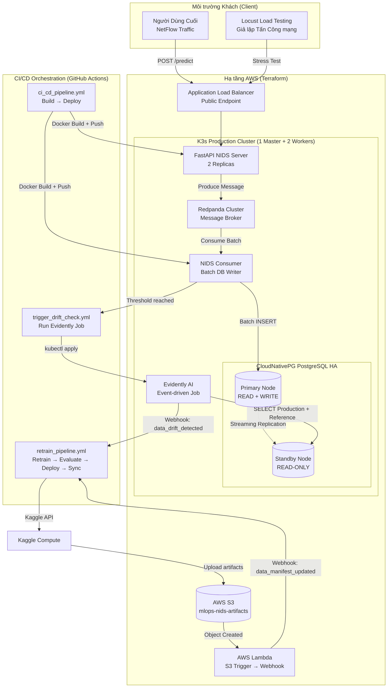
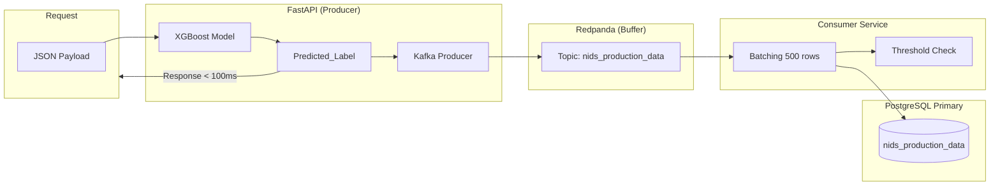
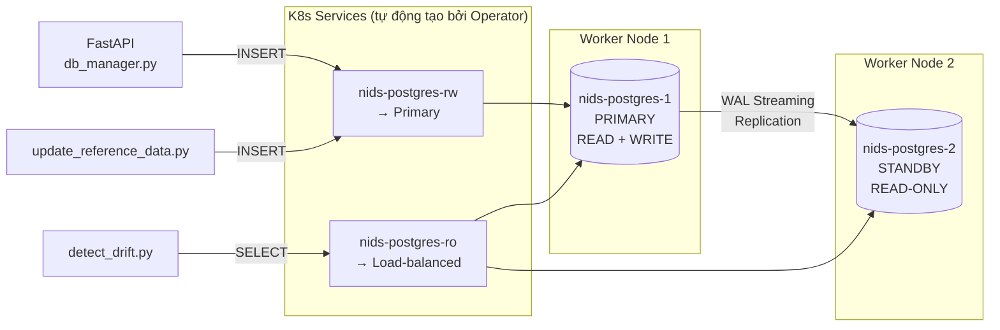
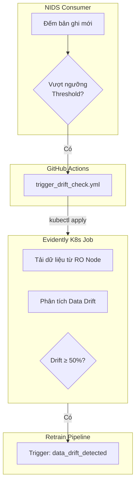
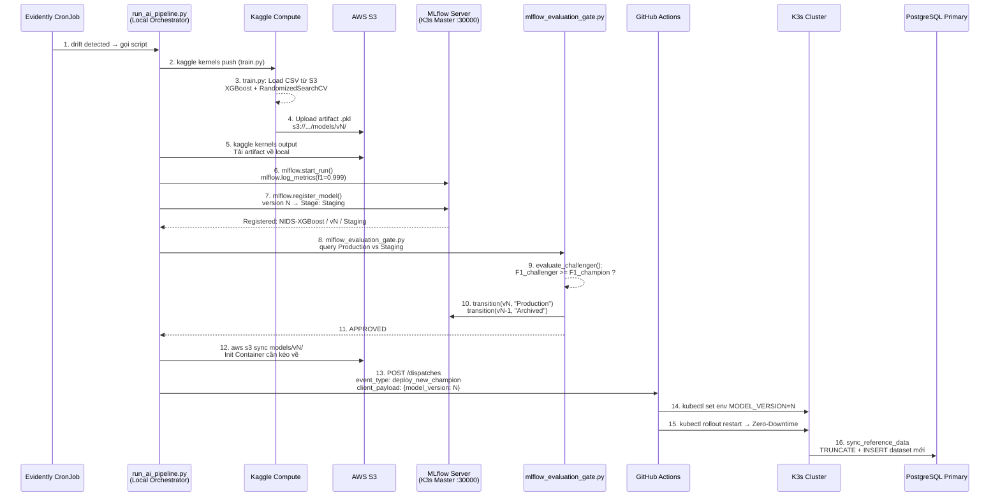
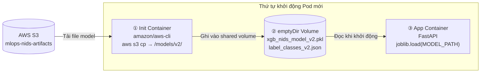
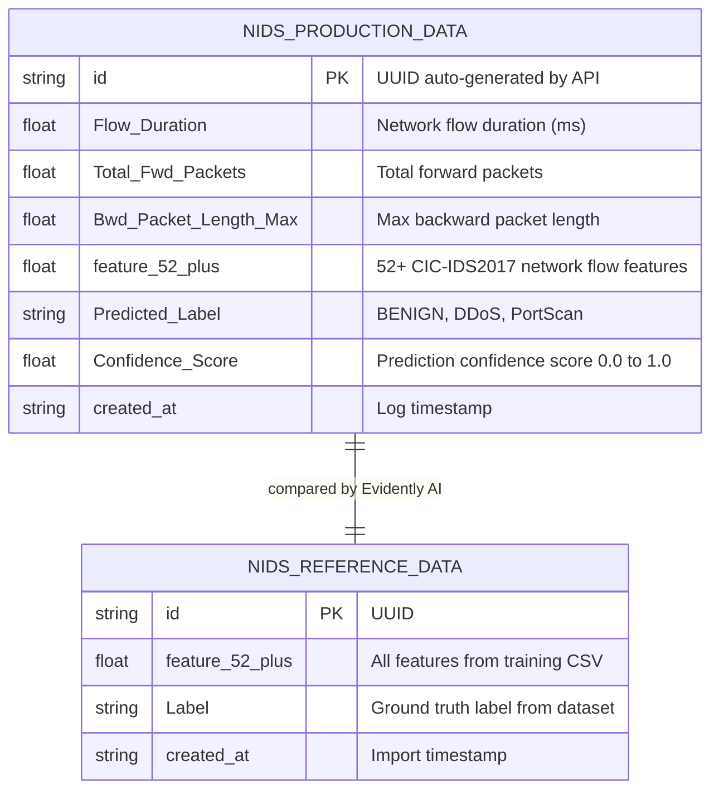

# Thiết kế Kiến trúc Hệ thống (System Architecture)

Tài liệu này đặc tả chi tiết kiến trúc của **Hệ thống MLOps Phát hiện Trôi Dữ liệu và Tái huấn luyện Tự động cho Mô hình Phát hiện Tấn công Mạng (NIDS)** dựa trên tập dữ liệu CIC-IDS2017.

---

## 1. Kiến trúc Tổng thể (High-Level Architecture)

Hệ thống được thiết kế theo vòng lặp khép kín **Closed-Loop MLOps**: Data -> Inference -> Monitor -> Retrain -> Deploy -> Data.



---

## 2. Chi tiết Từng Thành phần

### 2.1. Lớp Suy diễn và Ghi log (Inference & Logging Layer)

Request được xử lý song song theo 2 nhánh: **Inference** (đồng bộ, trả kết quả ngay) và **Logging** (bất đồng bộ, không ảnh hưởng latency).



**File model được nạp từ emptyDir Volume** do Init Container kéo từ S3 mỗi khi Pod khởi động - không bao giờ baked vào Docker Image.

### 2.2. Lớp Cơ sở Dữ liệu HA (CloudNativePG)



Khi Primary Node sập, CloudNativePG Operator tự động **thăng cấp Standby** lên làm Primary mới trong vòng 30-60 giây.

### 2.3. Lớp Giám sát Drift (Evidently AI CronJob)



### 2.4. Lớp Orchestration (Local Orchestrator)

**THAY ĐỔI LỚN:** Thay vì GitHub Actions làm nhạc trưởng (4 jobs), `run_ai_pipeline.py` chạy **LOCAL** (hoặc trên server riêng) làm nhạc trưởng của toàn bộ pipeline.

#### Luồng Retrain: run_ai_pipeline.py (Sequence Diagram)



### 2.5. Cơ chế Zero-Downtime Deployment (Init Container)



K3s thực hiện Rolling Update: Pod cũ (v1) tiếp tục phục vụ traffic trong khi Pod mới (v2) đang init - không có downtime.

### 2.6. Luồng Tự động Retrain qua S3 Artifact Notification

Hệ thống hỗ trợ việc kích hoạt huấn luyện lại khi Data Engineer tải dữ liệu manifest mới lên S3.

1. **User/System** tải `data_manifest.json` lên S3 Bucket.
2. **S3 Event Notification** bắt được sự kiện `ObjectCreated`.
3. **AWS Lambda** được kích hoạt, trích xuất thông tin manifest.
4. **Lambda** gửi `repository_dispatch` tới GitHub API với `event_type: data_manifest_updated`.
5. **GitHub Actions** nhận tín hiệu và khởi chạy `retrain_pipeline.yml`.

---

## 3. Lược đồ Cơ sở Dữ liệu (Database Schema)



`nids_reference_data` được **tự động cập nhật** sau mỗi lần retrain thành công bởi `update_reference_data.py` - đảm bảo Evidently luôn dùng dataset training mới nhất làm baseline.

---

## 4. Hạ tầng AWS (Terraform) - TO-BE

```
ap-southeast-1 (Singapore)
├── VPC: 10.0.0.0/16
│   ├── Public Subnet 1a (10.0.1.0/24)  - Master Node + NAT Gateway
│   ├── Public Subnet 1b (10.0.3.0/24)  - ALB (Multi-AZ)
│   └── Private Subnet 1a (10.0.2.0/24) - Worker Nodes
│
├── EC2 Instances
│   ├── ip-10-0-1-219  - t3.medium: K3s Master (control-plane)
│   │                       ★ MLflow Server Pod chạy tại đây (NodePort 30000)
│   │                       ★ Backend: CloudNativePG PostgreSQL (dùng chung cluster)
│   ├── ip-10-0-2-244  - t3.medium: K3s Worker 1 + Postgres PRIMARY
│   └── ip-10-0-2-8    - t3.medium: K3s Worker 2 + Postgres STANDBY
│
├── Application Load Balancer (mlops-api-lb)
│   └── Listener :80 → Target Group → Worker Port 80 (Traefik Ingress)
│
└── S3 Bucket: mlops-nids-artifacts
    ├── models/v1/  ← xgb_nids_model_v1.pkl + label_classes_v1.json + metrics_v1.json
    ├── models/v2/  ← xgb_nids_model_v2.pkl + label_classes_v2.json + metrics_v2.json
    ├── mlflow-artifacts/  ← ★ MLflow artifact store (model binaries + mlruns)
    ├── training-data/  ← train_2_classes.csv + train_3_classes.csv
    └── data_manifest.json  ← "Source of Truth" about the current dataset
```

---

## 5. Khả năng Mở rộng và Chịu tải (Scalability)

Việc chuyển đổi từ ghi log trực tiếp sang mô hình **Data Streaming (Redpanda)** mang lại các ưu điểm vượt trội:

| Đặc điểm | Ghi trực tiếp (Cũ) | Data Streaming (Mới) | Lý do cải thiện |
|---|---|---|---|
| **Latency** | Phụ thuộc vào tốc độ phản hồi của DB | < 5ms (ghi vào RAM broker) | API không phải chờ DB xử lý logic INSERT phức tạp. |
| **Throughput** | Bị giới hạn bởi số lượng connection pool | Hàng trăm nghìn tin nhắn/giây | Redpanda xử lý I/O theo mô hình đĩa tuần tự (Sequential I/O) cực nhanh. |
| **Độ bền dữ liệu** | Có thể mất data nếu DB sập khi đang log | Được lưu trữ an toàn trên Broker | Redpanda lưu message vào đĩa trước khi Consumer lấy đi, tránh mất dữ liệu. |
| **Khả năng mở rộng** | Khó mở rộng vì DB gắn chặt với API | Dễ dàng tăng số lượng Consumer | Có thể chạy nhiều Consumer song song để đẩy dữ liệu vào nhiều đích khác nhau. |

---

## 6. Mục tiêu Hiệu năng (Performance SLA)

| Chỉ số | Mục tiêu | Cơ chế đạt được |
| --- | --- | --- |
| **Độ trễ API Inference** | < 100ms | Model cache trong RAM (emptyDir Volume) |
| **Bảo toàn Dữ liệu** | 100% requests được ghi log | Async Background Task trong FastAPI |
| **Downtime khi Deploy** | 0% | Rolling Update + Init Container |
| **Phục hồi DB khi sập** | < 60 giây | CloudNativePG Auto Failover |
| **Chu kỳ Retrain** | < 2 giờ | Kaggle GPU/CPU -> S3 -> K3s |
| **Phát hiện Drift** | Hằng ngày 0h UTC | Evidently CronJob |
| **MLflow Query** | < 1s | PostgreSQL backend (dùng chung với nids_db) |

---

## 6. MLflow Model Registry — Chi tiết

### 6.1. Stages

| Stage | Ý nghĩa |
| --- | --- |
| **Staging** | Model mới train, đang trong quá trình đánh giá |
| **Production** | Model hiện đang phục vụ inference trên production |
| **Archived** | Model cũ đã bị thay thế, giữ lại để so sánh |

### 6.2. Backend

- **PostgreSQL (CloudNativePG)** (recommend): Dùng chung cluster `nids-postgres`, tạo database `mlflow` riêng biệt
- MLflow artifact root: `s3://mlops-nids-artifacts/mlflow-artifacts/` (không lưu trên volume)

### 6.3. Truy cập MLflow UI

```
# Sau khi deploy k8s/mlflow-deployment.yaml:
http://<master-node-public-ip>:30000

# Các chức năng:
# - Experiments: xem tất cả các run với params, metrics, artifacts
# - Models: xem Registry với các version + stage
# - Compare: so sánh các run với nhau
```

---

## 7. So sánh Before vs After (Orchestration)

| Tiêu chí | Before (GitHub Actions Orchestrator) | After (MLflow-Centric Orchestrator) |
|---|---|---|
| **Nhạc trưởng** | GitHub Actions (4 jobs nối tiếp) | `run_ai_pipeline.py` (Local Python) |
| **Trigger** | CRON + Webhook (Evidently) + Manual | Webhook (`deploy_new_champion`) + Manual |
| **Kaggle API** | GitHub Actions poll (trong job) | Local script poll (ngoài CI/CD) |
| **Metrics storage** | File JSON: S3 + GitHub Artifacts + repo | MLflow Model Registry (PostgreSQL) |
| **Evaluation** | `evaluate_model.py` đọc JSON từ S3/Artifacts | `mlflow_evaluation_gate.py` query MLflow trực tiếp |
| **Stage transition** | jq sửa data_manifest.json | `client.transition_model_version_stage()` |
| **MODEL_VERSION** | Hardcoded trong YAML, hoặc jq đọc manifest | Từ `client_payload.model_version` webhook |
| **GitHub Jobs** | 4 jobs (retrain + eval + deploy + sync) | 2 jobs (deploy + sync) |
| **Pipeline complexity** | Cao (nhiều I/O file, nhiều nguồn sự thật) | Thấp (chỉ deploy, không suy nghĩ) |

---

_Last updated: 2026-04-11 - UIT · NT114 · MLOps NIDS System Project_
