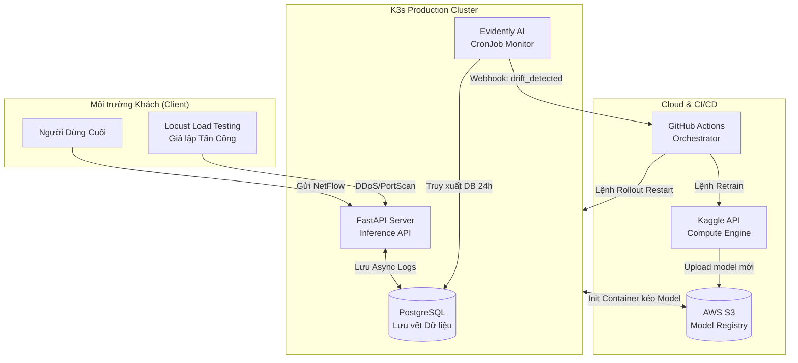
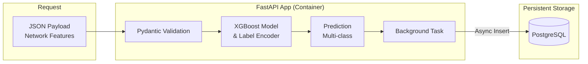
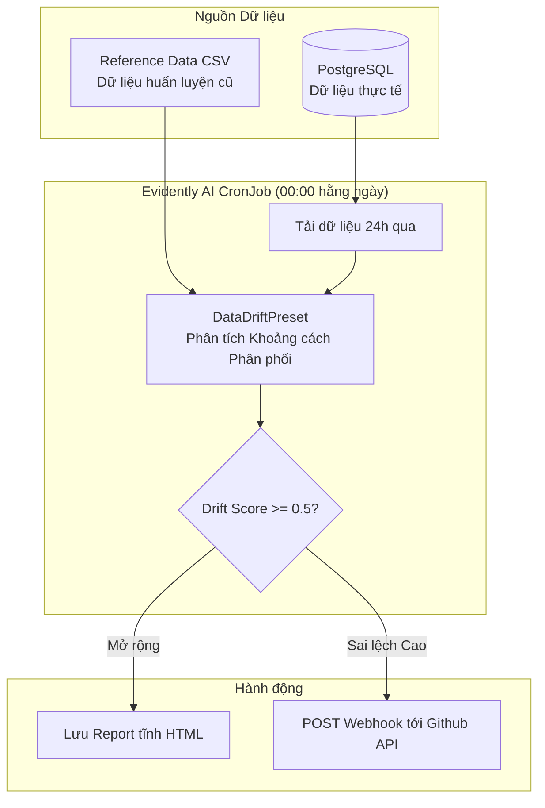
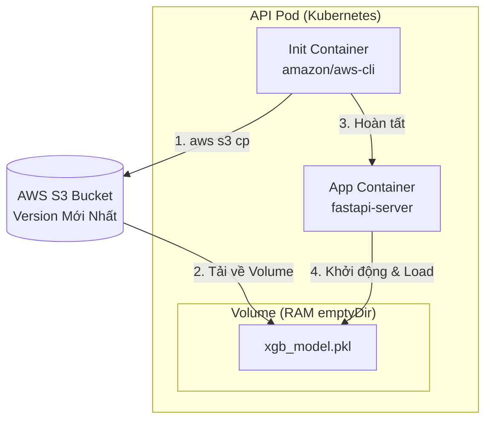
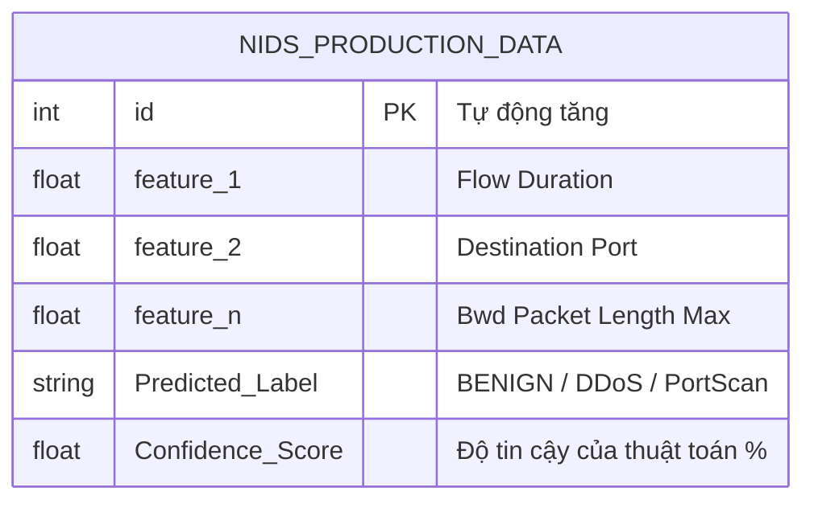
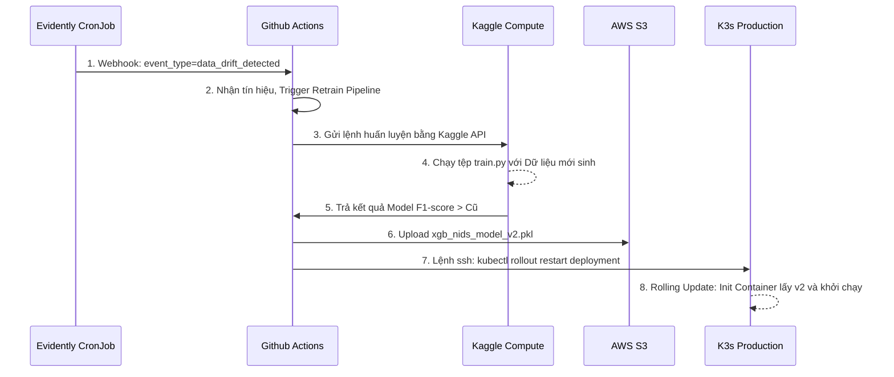

# Thiết kế Kiến trúc Hệ thống (System Architecture)

Tài liệu này đặc tả chi tiết kiến trúc của Hệ thống MLOps Phát hiện Trôi Dữ liệu và Tái huấn luyện tự động cho Mô hình Phát hiện Tấn công Mạng (NIDS).

---

## 1. Kiến trúc Tổng thể (High-Level Architecture)

---

## 2. Thiết kế Mạch Thành phần (Component Diagram)

### 2.1. Lớp Suy diễn và Ghi log (API & Inference Layer)

### 2.2. Lớp Giám sát và Cảnh báo (Monitoring Layer)

### 2.3. Lớp K3s Deployment - Zero Downtime Updates

*(Cơ chế:* Khi nhận lệnh cập nhật từ Github Actions, K3s tạo Pod mới. Pod mới sẽ chạy Init Container trước. Init Container kết nối đến S3, tải file model nặng thả vào RAM ảo, sau đó App Container mới khởi động và lấy file đó để phục vụ. *Zero-downtime)*

---

## 3. Bản đồ Thiết kế Cơ sở Dữ liệu (Database Schema)

Thu thập thông tin Log bằng tính năng Background Tasks để không làm tăng thời gian phản hồi (latency) của API:

*Lưu ý: Bàn NIDS_PRODUCTION_DATA chứa toàn bộ các cặp Key-Value payload mà Client gửi tới cộng với Nhãn dự đoán. Lược đồ động phụ thuộc vào số lượng Feature sinh ra trong quá trình Tiền Xử Lý dữ liệu CIC-IDS2017.*

---

## 4. Luồng Xử lý CI/CD/CT (Continuous Pipelines)

---

## Mục tiêu Hiệu năng (Performance SLA)

| Hệ quy chiếu | Target MLOps |
|--------|--------|
| **Độ trễ API Inference** | < 100ms (Đạt được nhờ cache model vào RAM) |
| **Bảo toàn Dữ liệu** | Lưu vết 100% Request với Async Background Task |
| **Gián đoạn Dịch vụ (Downtime)** | 0% (Rolling update + K3s Init container) |
| **Tự động thay đổi Trọng số** | < 2 giờ (Kể từ khi kích hoạt chạy Kaggle Training đến lúc cập nhật k8s) |

---
*Created for MLOps NIDS System Project*
