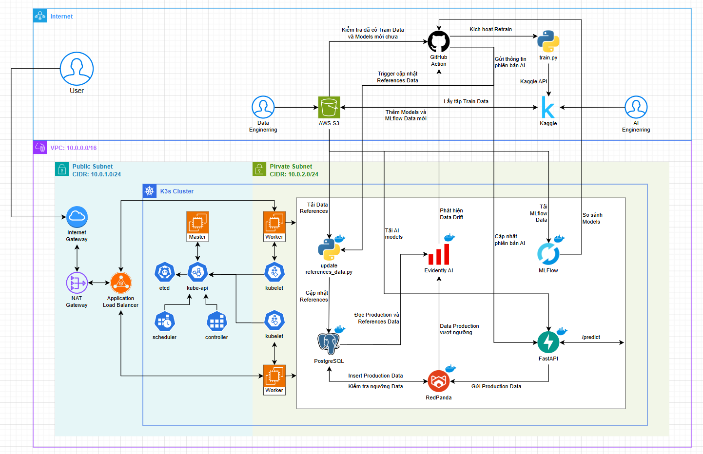

<div align="center">

# MLOps NIDS System

### An End-to-End MLOps Architecture for Data Drift Monitoring and Continuous Retraining in Network Intrusion Detection Systems

[](https://python.org)
[](https://fastapi.tiangolo.com)
[](https://xgboost.readthedocs.io)
[](https://k3s.io)
[](https://aws.amazon.com)
[](LICENSE)

**Học phần:** NT114 - Đồ án Chuyên ngành · Khoa Mạng máy tính và Truyền thông dữ liệu · UIT

| Thành viên             | Email                  | Phụ trách                                                       |
| ---------------------- | ---------------------- | --------------------------------------------------------------- |
| Trần Nguyễn Việt Hoàng | 23520541@gm.uit.edu.vn | MLOps Architecture + FastAPI + Evidently AI + Training Pipeline |
| Bùi Ngọc Thái          | 23521412@gm.uit.edu.vn | K3s Operations + Terraform/AWS + CI/CD + CloudNativePG          |

</div>

---

## 📖 Tổng quan

Hệ thống này là một **MLOps pipeline hoàn chỉnh end-to-end** được xây dựng chuyên biệt cho bài toán phát hiện tấn công mạng (NIDS). Điểm nổi bật là khả năng **tự vận hành khép kín**: tự phát hiện khi dữ liệu thực tế bị lệch so với dữ liệu training, tự kích hoạt quá trình tái huấn luyện, và tự triển khai model mới mà **không gây gián đoạn dịch vụ** (zero-downtime).

```
Client Traffic → FastAPI (Inference) → PostgreSQL (Logging)
                                              ↓
                                   Evidently AI (Daily Drift Check)
                                              ↓ drift detected
                                   GitHub Actions (Retrain Pipeline)
                                              ↓
                              Kaggle Compute → evaluate_model.py → K3s Deploy
                                              ↓ success
                                   update_reference_data.py (Close the Loop)
```

---

## ✨ Tính năng Cốt lõi

| #   | Tính năng                                                                    | Công nghệ                    |
| --- | ---------------------------------------------------------------------------- | ---------------------------- |
| 1   | **Phân loại tấn công mạng** BENIGN / DDoS / PortScan với F1 > 99%            | XGBoost + CIC-IDS2017        |
| 2   | **Low-latency inference** < 100ms, model nạp vào RAM                         | FastAPI + Uvicorn            |
| 3   | **Async logging** mọi request vào DB mà không tăng latency                   | BackgroundTasks + PostgreSQL |
| 4   | **PostgreSQL HA** Primary + Standby, auto failover < 60s                     | CloudNativePG + K3s          |
| 5   | **Daily drift detection** 0h UTC, phân tích phân phối 70+ features           | Evidently AI + CronJob       |
| 6   | **Automated retraining** khi drift ≥ 50%, không cần can thiệp thủ công       | Kaggle API + GitHub Actions  |
| 7   | **Model quality gate** - chỉ promote model mới khi vượt Champion             | evaluate_model.py            |
| 8   | **Zero-downtime deployment** Rolling update + Init Container kéo model từ S3 | K3s + AWS S3                 |
| 9   | **Closed-loop feedback** - baseline tự cập nhật sau mỗi lần retrain          | update_reference_data.py     |
| 10  | **Load testing & drift simulation** giả lập DDoS / PortScan đồng thời        | Locust                       |

---

## 🏗️ Kiến trúc Hệ thống



> Xem chi tiết kiến trúc và các diagram tại [ARCHITECTURE.md](ARCHITECTURE.md)

---

## 🛠️ Technology Stack

| Layer                  | Technology                                   |
| ---------------------- | -------------------------------------------- |
| **Machine Learning**   | XGBoost + Scikit-learn + Pandas + MLflow     |
| **Model Serving**      | FastAPI + Uvicorn + Python 3.10              |
| **Database (HA)**      | PostgreSQL 15 + CloudNativePG + SQLAlchemy   |
| **Drift Monitoring**   | Evidently AI + DataDriftPreset + K8s CronJob |
| **Load Testing**       | Locust                                       |
| **Compute Engine**     | Kaggle Kernels API                           |
| **CI/CD/CT**           | GitHub Actions                               |
| **Container Registry** | Docker Hub                                   |
| **Model Registry**     | AWS S3                                       |
| **Orchestration**      | K3s (Kubernetes)                             |
| **Infrastructure**     | Terraform + AWS (VPC + EC2 + ALB + S3)       |

---

## 📁 Cấu trúc Thư mục

```
mlops-nids-system/
├── .github/
│   ├── workflows/
│   │   ├── ci_cd_pipeline.yml        # Build -> Push Docker -> Deploy K3s
│   │   └── retrain_pipeline.yml      # Retrain -> Evaluate -> Deploy -> Sync
│   └── scripts/
│       ├── evaluate_model.py         # Model quality gate (Champion vs Challenger)
│       └── update_reference_data.py  # Sync baseline after retrain
├── api/
│   ├── src/
│   │   ├── index.py                  # GET + POST /predict
│   │   └── db_manager.py             # Dual-endpoint: engine_rw + engine_ro
│   ├── Dockerfile
│   └── requirements.txt
├── monitoring/
│   ├── detect_drift.py               # Evidently AI + nids-postgres-ro
│   ├── Dockerfile
│   └── requirements.txt
├── kaggle_training/
│   ├── train.py                      # XGBoost + MLflow + Hyperparameter Tuning
│   └── kernel-metadata.json
├── k8s/
│   ├── api-deployment.yaml           # FastAPI + Init Container + ClusterIP + Traefik Ingress
│   ├── postgres-cluster.yaml         # CloudNativePG Primary + Standby
│   └── evidently-cronjob.yaml        # CronJob 0h UTC daily
├── infra/
│   ├── main.tf                       # VPC + EC2 + ALB + S3 (Terraform)
│   └── variables.tf
├── web/src/
│   ├── test_api.py                   # Basic API test
│   └── locustfile.py                 # Stress test + drift simulation
├── models/
│   ├── v1/                           # 2-class: BENIGN + DDoS
│   └── v2/                           # 3-class: + PortScan
├── data_manifest.json                # "Source of Trust": target_csv + model_version
├── docker-compose.yml                # Local development environment
└── .env.example                      # Environment variable template
```

---

## 🚀 Hướng dẫn Cài đặt và Khởi chạy

### Yêu cầu Hệ thống

| Thành phần              | Tối thiểu                   | Khuyến nghị  |
| ----------------------- | --------------------------- | ------------ |
| Python                  | 3.10+                       | 3.10         |
| Docker & Docker Compose | v24+                        | Latest       |
| RAM                     | 4 GB                        | 8 GB         |
| OS                      | Windows 10+ / Ubuntu 20.04+ | Ubuntu 22.04 |

---

### 🖥️ Chạy Local (Docker Compose)

Cách nhanh nhất để chạy thử hệ thống trên máy local mà không cần K3s hay AWS.

**Bước 1: Clone repository**

```bash
git clone https://github.com/Viet-Hoang-2005/MLOps-weather-system.git
cd mlops-nids-system
```

**Bước 2: Cấu hình biến môi trường**

```bash
cp .env.example .env
```

Chỉnh sửa file `.env` với thông tin của bạn:

```ini
# PostgreSQL
DB_USER=your_db_user_here
DB_PASSWORD=your_db_password_here
DB_HOST=localhost
DB_PORT=5432
DB_NAME=mlops_nids_db

# Evidently Webhook
GITHUB_REPO=Viet-Hoang-2005/MLOps-nids-system
GITHUB_TOKEN=your_github_token_here
DRIFT_THRESHOLD=0.5

# AWS (cần để script CI/CD chạy)
AWS_ACCESS_KEY_ID=your_aws_access_key_id_here
AWS_SECRET_ACCESS_KEY=your_aws_secret_access_key_here
AWS_DEFAULT_REGION=your_aws_default_region_here
```

**Bước 3: Build và khởi chạy**

```bash
docker-compose up --build

# Theo dõi log API
docker-compose logs -f api

# Theo dõi Data Drift bằng Evidently
docker-compose logs -f evidently
```

**Bước 4: Kiểm tra hoạt động**

```bash
# Health check
curl http://localhost:5000/

# Test predict endpoint
python web/src/test_api.py

# Locust test
locust -f web/src/locustfile.py --host=http://localhost:5000
```

Locust Dashbroad: `http://localhost:8089`
API Swagger UI: `http://localhost:5000/docs`

**Dừng hệ thống:**

```bash
docker-compose down
```

---

### ☁️ Triển khai Production (K3s trên AWS EC2)

#### Bước 1: Khởi tạo hạ tầng AWS bằng Terraform

```bash
cd infra/
terraform init
terraform plan
terraform apply
```

Terraform sẽ tạo: VPC + 3 EC2 (1 Master + 2 Workers) + ALB + S3 Bucket

#### Bước 2: Cài đặt K3s lên các EC2

```bash
# Trên Master Node
curl -sfL https://get.k3s.io | sh -
sudo cat /etc/rancher/k3s/k3s.yaml  # Copy nội dung này vào GitHub Secret KUBE_CONFIG
sudo cat /var/lib/rancher/k3s/server/node-token # Copy token này để thêm Worker Node

# Trên mỗi Worker Node (thay <TOKEN> và <MASTER_IP>)
curl -sfL https://get.k3s.io | K3S_URL=https://<MASTER_IP>:6443 K3S_TOKEN=<TOKEN> sh -

# Xác nhận cluster
sudo k3s kubectl get nodes
```

#### Bước 3: Cài đặt CloudNativePG Operator

```bash
kubectl apply --server-side -f \
  https://raw.githubusercontent.com/cloudnative-pg/cloudnative-pg/release-1.22/releases/cnpg-1.22.0.yaml

kubectl wait --for=condition=ready pod -n cnpg-system \
  -l app.kubernetes.io/name=cloudnative-pg --timeout=120s
```

#### Bước 4: Tạo Kubernetes Secrets

```bash
# AWS credentials (cho Init Container kéo model từ S3)
kubectl create secret generic aws-secrets \
  --from-literal=AWS_ACCESS_KEY_ID="<your-key>" \
  --from-literal=AWS_SECRET_ACCESS_KEY="<your-secret>"

# GitHub Token (cho Evidently Webhook)
kubectl create secret generic github-secrets \
  --from-literal=GITHUB_TOKEN="<your-token>"

# PostgreSQL credentials
kubectl create secret generic postgres-secrets \
  --from-literal=POSTGRES_USER="postgres" \
  --from-literal=POSTGRES_PASSWORD="<strong-password>"
```

#### Bước 5: Upload model lên S3

```bash
aws s3 cp models/v1/xgb_nids_model_v1.pkl s3://mlops-nids-artifacts/models/v1/
aws s3 cp models/v1/label_classes_v1.json s3://mlops-nids-artifacts/models/v1/
aws s3 cp models/v1/metrics_v1.json s3://mlops-nids-artifacts/models/v1/
aws s3 cp data_manifest.json s3://mlops-nids-artifacts/
```

#### Bước 6: Deploy lên K3s

```bash
# PostgreSQL Cluster (Primary + Standby)
kubectl apply -f k8s/postgres-cluster.yaml
kubectl wait --for=condition=Ready cluster/nids-postgres --timeout=180s

# FastAPI Server
kubectl apply -f k8s/api-deployment.yaml

# Evidently CronJob
kubectl apply -f k8s/evidently-cronjob.yaml

# Kiểm tra trạng thái
kubectl get pods,services,cronjob -o wide
```

#### Bước 7: Cấu hình GitHub Secrets cho CI/CD

Trong `GitHub Repo -> Settings -> Secrets and variables -> Actions`:

| Secret                  | Mô tả                                         |
| ----------------------- | --------------------------------------------- |
| `DOCKERHUB_USERNAME`    | Docker Hub username                           |
| `DOCKERHUB_TOKEN`       | Docker Hub Access Token                       |
| `AWS_ACCESS_KEY_ID`     | AWS IAM Access Key                            |
| `AWS_SECRET_ACCESS_KEY` | AWS IAM Secret Key                            |
| `KUBE_CONFIG`           | Nội dung file `~/.kube/config` từ Master Node |
| `KAGGLE_USERNAME`       | Kaggle username                               |
| `KAGGLE_KEY`            | Kaggle API Key                                |
| `DB_HOST`               | IP Public của PostgreSQL / Master Node        |
| `DB_USER`               | `postgres`                                    |
| `DB_PASSWORD`           | Password đã đặt ở Bước 4                      |

---

### 🧪 Kiểm thử Hệ thống

**Test API cơ bản:**

```bash
python web/src/test_api.py
```

**Stress test & giả lập Data Drift bằng Locust:**

```bash
pip install locust
locust -f web/src/locustfile.py --host=http://<ALB-DNS-hoặc-localhost:5000>
# Truy cập Locust Dashboard: http://localhost:8089
# Khuyến nghị: 50 users + spawn 5/s + chạy 5 phút để tạo đủ 100+ production samples
```

**Chạy Evidently drift detection thủ công:**

```bash
pip install -r monitoring/requirements.txt
python monitoring/detect_drift.py
```

**Kích hoạt Retrain Pipeline thủ công:**

Vào `GitHub -> Actions -> MLOps NIDS Retraining Pipeline -> Run workflow`

---

### 🔧 Xử lý Sự cố Thường gặp

| Vấn đề                        | Nguyên nhân                  | Giải pháp                                       |
| ----------------------------- | ---------------------------- | ----------------------------------------------- |
| Port 5000/5432 bị chiếm       | Có service khác đang chạy    | `docker-compose down` hoặc tắt PostgreSQL local |
| `psycopg2.OperationalError`   | `DB_HOST` sai                | Local: `localhost`; K3s: `nids-postgres-rw`     |
| Init Container fail           | S3 path hoặc credentials sai | `kubectl logs <pod> -c aws-s3-model-sync`       |
| Evidently skip analysis       | Production data < 100 mẫu    | Chạy Locust thêm để tạo đủ data                 |
| CloudNativePG cluster pending | Operator chưa ready          | `kubectl get pods -n cnpg-system`               |

---

## 📚 Tài liệu Liên quan

| Tài liệu                           | Mô tả                                              |
| ---------------------------------- | -------------------------------------------------- |
| [ARCHITECTURE.md](ARCHITECTURE.md) | Kiến trúc chi tiết, diagrams, database schema      |
| [CHANGELOG.md](CHANGELOG.md)       | Lịch sử phát triển theo từng giai đoạn             |
| [CONTRIBUTING.md](CONTRIBUTING.md) | Quy tắc đóng góp, branch naming, commit convention |

---

<div align="center">

_Developed for UIT · NT114 · MLOps NIDS System Project_

</div>
