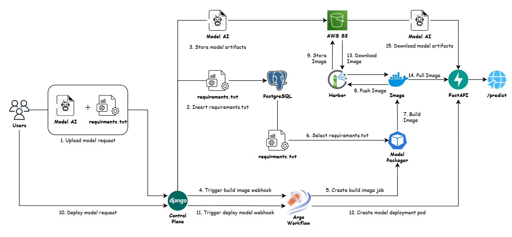
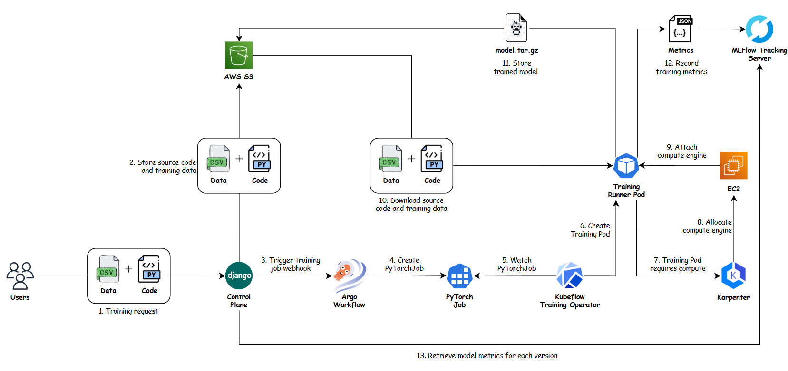
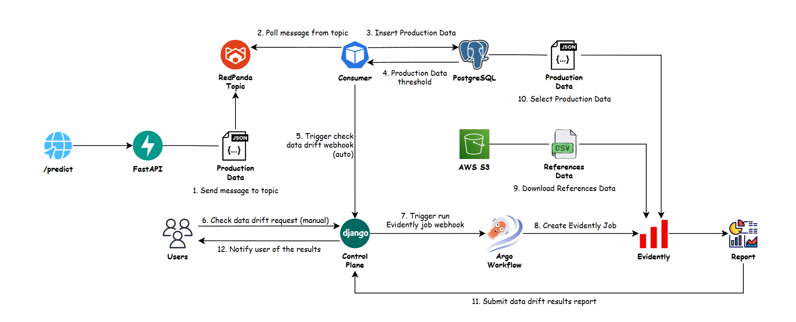

<div align="center">

# MLOps PaaS System

### Nền tảng AI PaaS End-to-End phục vụ đa mô hình ML/DL cho các tác vụ xây dựng, triển khai, giám sát, huấn luyện và quản lý phiên bản mô hình

[](https://python.org)
[](https://djangoproject.com)
[](https://fastapi.tiangolo.com)
[](https://mlflow.org)
[](https://evidentlyai.com)
[](https://redpanda.com)
[](https://kubeflow.org)
[](https://karpenter.sh)
[](https://argoproj.github.io/workflows)
[](https://k3s.io)
[](https://www.terraform.io)
[](https://ansible.com)

**Khoa Mạng máy tính và Truyền thông dữ liệu · Trường Đại học Công nghệ Thông tin (UIT) · ĐHQG-HCM**

| Thành viên             | Email                    |
| ---------------------- | ------------------------ |
| Trần Nguyễn Việt Hoàng | <23520541@gm.uit.edu.vn> |
| Bùi Ngọc Thái          | <23521412@gm.uit.edu.vn> |

</div>

---

## 1. Tổng quan ⭐

Hệ thống này là một **nền tảng AI Platform-as-a-Service (AI PaaS) MLOps hoàn chỉnh** cung cấp kiến trúc đa người thuê (Multi-Tenant), tự động hóa toàn diện từ giai đoạn phát triển mô hình (Model Packaging), triển khai dịch vụ suy luận động (Dynamic Serving), theo dõi chất lượng mô hình (Drift Monitoring) đến tự động tái huấn luyện trên hạ tầng điều phối GPU mở rộng tự động (Kubeflow + Karpenter).

---

## 2. Tính năng Cốt lõi ✨

| #   | Tính năng                                      | Mô tả chi tiết                                                                                     | Công nghệ                          |
| --- | ---------------------------------------------- | -------------------------------------------------------------------------------------------------- | ---------------------------------- |
| 1   | **Multi-Tenant AI PaaS**                       | Cách ly tài nguyên, quyền hạn và dữ liệu giữa các người dùng/tổ chức với Asymmetric RS256 JWT     | Django DRF + JWKS + Asymmetric JWT |
| 2   | **Event-Driven Build & Package**               | Đóng gói mô hình bằng Docker SDK (Local) và Kaniko Rootless (Production K3s), ký Cosign | Argo Workflows + Harbor + Kaniko |
| 3   | **Dynamic Model Serving**                      | Tự động tạo, định tuyến và thu hồi endpoint suy luận động theo `tenant_id` và `model_id`           | Traefik IngressRoute + FastAPI     |
| 4   | **Automated Drift Detection**                  | Lập lịch giám sát chất lượng dữ liệu định kỳ bằng Evidently AI, gửi Webhook khi phát hiện độ lệch  | Evidently AI + Argo Workflows      |
| 5   | **Event-Driven Training Orchestration**        | Argo Events lắng nghe Webhook để kích hoạt job huấn luyện phân tán qua Kubeflow Training Operator  | Argo Events + Kubeflow PyTorchJob  |
| 6   | **GPU Auto-Scaling & Cost Optimization**       | Tự động cung cấp (provision) và thu hồi node GPU EC2 theo nhu cầu huấn luyện thực tế (Scale-to-Zero)| Karpenter NodePool                 |
| 7   | **Real-Time Log Streaming & HTTP Polling**     | Stream log huấn luyện và build vào Redis Cache, Frontend React cập nhật liên tục qua HTTP Polling  | Redis + React (3s Polling interval)|
| 8   | **Model Registry & HitL Governance**           | Quản lý vòng đời mô hình (Staging, Production, Archived) với cơ chế phê duyệt Human-in-the-Loop    | MLflow Model Registry + AWS S3     |
| 9   | **Zero-Downtime GitOps Deployment**            | Tự động hóa cập nhật phiên bản mô hình production qua ArgoCD mà không gây gián đoạn dịch vụ        | ArgoCD GitOps + GitHub Actions     |
| 10  | **High-Availability Storage & Messaging**      | Cụm cơ sở dữ liệu PostgreSQL HA (Primary-Standby auto failover < 60s) và hàng đợi Redpanda tốc độ cao| CloudNativePG + Redpanda Kafka     |
| 11  | **Full-Stack Observability**                   | Giám sát toàn diện API Latency, Throughput, Error Rate, tài nguyên K3s và Kafka Lag                | Prometheus + Grafana + AlertManager|
| 12  | **Automated Infrastructure & IaC**             | Chuẩn hóa hạ tầng AWS bằng Terraform và cài đặt hoàn toàn cụm K3s cùng Add-ons chỉ qua 1 lệnh      | Terraform + Ansible Playbook       |

---

## 3. Kiến trúc Hệ thống 🏛️

**1. Quy trình Đóng gói & Triển khai Mô hình (Build & Deploy Workflow)**



**2. Quy trình Huấn luyện & Điều phối Tài nguyên (Training Workflow)**



**3. Quy trình Giám sát & Phát hiện Độ lệch Dữ liệu (Data Drift Workflow)**



> 💡 **Tài liệu Kỹ thuật Chuyên sâu:** Xem giải thích chi tiết về luồng dữ liệu, sơ đồ tuần tự (Sequence Diagrams), cơ chế bảo mật Zero-Trust và lược đồ cơ sở dữ liệu tại [ARCHITECTURE.md](ARCHITECTURE.md).

---

## 4. Công nghệ sử dụng ⚙️

| Lớp (Layer)                | Công nghệ / Thư viện                                      | Vai trò trong Hệ thống                                                  |
| -------------------------- | --------------------------------------------------------- | ----------------------------------------------------------------------- |
| **Machine Learning**       | XGBoost, Scikit-learn, PyTorch, TensorFlow                | Framework xây dựng và huấn luyện mô hình ML/DL                           |
| **Model Serving**          | FastAPI, BentoML, Traefik IngressRoute                    | Gateway phục vụ suy luận động (Dynamic Inference Routing)               |
| **Training Orchestration** | Kubeflow Training Operator (PyTorchJob), Argo Workflows   | Điều phối huấn luyện mô hình phân tán và luồng sự kiện                 |
| **Drift Detection**        | Evidently AI, Argo Workflows (Cron Scheduled)             | Giám sát Data Drift và Concept Drift theo lịch trình                    |
| **Control Plane**          | Django 4.x, Django REST Framework, Asymmetric JWT (RS256) | Quản lý tenant, xác thực, phân quyền RBAC và điều phối PaaS API         |
| **Message Broker**         | Redpanda (Kafka-compatible broker)                        | Hàng đợi tin nhắn tốc độ cao xử lý lưu lượng suy luận bất đồng bộ       |
| **Database (HA)**          | PostgreSQL 15, CloudNativePG Operator, SQLAlchemy         | Lưu trữ dữ liệu metadata, người dùng và dữ liệu suy luận production     |
| **Cache / Log Stream**     | Redis 7 Alpine                                            | Lưu trữ cache phiên làm việc và stream log thời gian thực cho UI polling|
| **Container Registry**     | Harbor Registry (Self-hosted), Cosign                     | Lưu trữ Docker image đa người thuê, ký xác thực bảo mật image           |
| **CI/CD & GitOps**         | GitHub Actions, ArgoCD                                    | Tự động hóa kiểm thử, đóng gói và triển khai liên tục theo mô hình GitOps|
| **Model Registry**         | MLflow, AWS S3 / MinIO                                    | Quản lý phiên bản mô hình, lưu trữ artifact và theo dõi thử nghiệm      |
| **Orchestration**          | K3s (Lightweight Kubernetes)                              | Nền tảng quản lý container hiệu năng cao trên Cloud / Edge              |
| **Infrastructure (IaC)**   | Terraform, AWS (VPC, EC2, ALB, S3, Route53, ACM)          | Khai báo và quản lý tự động hạ tầng đám mây Amazon Web Services         |
| **Automation**             | Ansible Playbook                                          | Tự động hóa cài đặt K3s Master/Worker và triển khai toàn bộ K8s Add-ons |
| **Security & Secrets**     | AWS Secrets Manager, External Secrets Operator (ESO)      | Quản lý bảo mật biến môi trường và đồng bộ secret vào Kubernetes         |
| **Observability**          | Prometheus, Grafana, AlertManager                         | Thu thập metrics, trực quan hóa dashboard và phát cảnh báo tự động      |
| **Autoscaling**            | KEDA (Event-driven), Karpenter NodePool                   | Tự động mở rộng pod theo event/kafka và mở rộng node GPU theo nhu cầu    |

---

## 5. Cấu trúc Thư mục 📁

```
MLOps-nids-system/
│
├── .github/
│   └── workflows/
│       ├── ci.yml                            # Build & push Docker images lên Harbor Registry
│       └── cd.yml                            # GitOps: Cập nhật image tag vào manifest -> ArgoCD auto-sync
│
├── services/
│   ├── control-plane/                        # Django: AI PaaS Control Plane API
│   │   └── src/
│   │       ├── authentication/               # Quản lý Tenant, User, RS256 JWT + JWKS Endpoint
│   │       ├── registry/                     # Quản lý vòng đời Model: Upload, Build, Deploy
│   │       ├── training/                     # Điều phối Training Jobs: Kubeflow/Local Adapter
│   │       ├── drift/                        # Giám sát Drift: Trigger & Webhook Handler
│   │       ├── deployment/                   # Deploy Adapter: Tạo/xóa Traefik IngressRoute
│   │       └── realtime/                     # Stream Log từ Redis cho UI HTTP Polling
│   │
│   ├── model-server/                         # FastAPI inference gateway & dynamic execution
│   ├── model-packager/                       # Đóng gói model artifact thành container service
│   ├── consumer/                             # Redpanda Consumer: Đọc Kafka topic & ghi batch vào DB
│   ├── evidently/                            # Evidently AI: Container chạy Drift Detection Job
│   ├── training-runner/                      # Container runtime cho Kubeflow / Argo Workflows training
│   ├── bento-model-server/                   # BentoML serving container (per-tenant)
│   └── test/                                 # Integration & End-to-End Test suites
│
├── k8s/
│   ├── apps/                                 # ArgoCD-managed manifests theo chuẩn GitOps
│   │   ├── base/                             # Base manifests: control-plane, web, consumer, redis...
│   │   └── production/                       # Production overlays: ingress, configmaps, replicas
│   │
│   ├── argo-workflows/                       # Argo Workflows: Event-driven Pipelines & Templates
│   │   ├── eventsource.yaml                  # EventSource: Lắng nghe webhook /train, /cancel-train
│   │   ├── sensor.yaml                       # Sensor: Map event thành WorkflowTemplate triggers
│   │   ├── build-workflowtemplate.yaml       # Kaniko rootless build Docker image & push Harbor
│   │   ├── deploy-workflowtemplate.yaml      # Tạo/xóa Traefik IngressRoute cho Model Endpoint
│   │   ├── training-workflowtemplate.yaml    # Khởi tạo Kubeflow PyTorchJob CRD
│   │   ├── training-cancel-workflowtemplate.yaml # Hủy job huấn luyện đang chạy
│   │   ├── evidently-workflowtemplate.yaml   # Lập lịch chạy Evidently Drift Detection Job
│   │   └── delete-workflowtemplate.yaml      # Dọn dẹp tài nguyên khi xóa model
│   │
│   ├── kubeflow/                             # Kubeflow Training Operator (PyTorchJob / TFJob CRDs)
│   ├── karpenter/                            # Karpenter NodePool cấu hình auto-scale GPU EC2
│   ├── argocd/                               # Cấu hình ArgoCD Application & RBAC
│   ├── postgres/                             # CloudNativePG HA Cluster manifests
│   ├── redis/                                # Redis Deployment & Service
│   ├── redpanda/                             # Redpanda Kafka StatefulSet & Console
│   ├── harbor/                               # Harbor Registry & Cosign manifests
│   ├── monitoring/                           # Prometheus + Grafana + AlertManager stack
│   ├── security/                             # Network Policies (Zero-Trust isolation)
│   ├── storage/                              # AWS EBS StorageClass & PVCs
│   ├── secrets/                              # External Secrets Operator + ClusterSecretStore
│   ├── cloudflare/                           # Cloudflare Tunnel (Expose HTTPS an toàn)
│   ├── health/                               # Traefik Ping & ALB Health Check endpoints
│   └── scripts/                              # Shell scripts cài đặt Operators (Argo, KEDA, ESO...)
│
├── ansible/                                  # Ansible: Tự động hóa cài đặt & triển khai K3s
│   ├── ansible.cfg                           # Cấu hình SSH pipelining, remote_user, key
│   ├── site.yml                              # Main Playbook: Điều phối toàn bộ tiến trình
│   ├── inventory/                            # Dynamic & Static inventory templates
│   ├── group_vars/                           # Cấu hình biến cho Master và Worker nodes
│   └── roles/
│       ├── common/                           # Cài đặt gói cơ bản (curl, git, jq, nfs-common)
│       ├── k3s_master/                       # Cài K3s Server + thiết lập kubeconfig
│       ├── k3s_worker/                       # Join Worker nodes vào cluster qua SSH ProxyJump
│       ├── helm/                             # Cài đặt Helm 3 package manager
│       └── k8s_addons/                       # Tự động triển khai toàn bộ K8s Add-ons
│
├── infra/                                    # Terraform IaC: Khai báo hạ tầng AWS
│   ├── main.tf                               # Root module: VPC, EC2, ALB, S3, IAM Roles
│   ├── variables.tf                          # Định nghĩa biến cấu hình (CIDR, instance type...)
│   ├── outputs.tf                            # Xuất IP, DNS, ARN phục vụ Ansible inventory
│   └── modules/
│       ├── network/                          # VPC, Public/Private Subnets, IGW, NAT Gateway
│       ├── compute/                          # EC2 Master (t3.medium) + Worker Nodes (t3.large)
│       ├── security/                         # Security Groups (Master, Worker, ALB, DB)
│       ├── storage/                          # S3 Bucket lưu model artifacts & datasets
│       ├── iam/                              # IAM Roles cho Worker profile & GitHub OIDC
│       ├── alb/                              # Application Load Balancer + Target Groups
│       ├── dns/                              # Route53 DNS records + ACM SSL Certificate
│       └── secrets/                          # AWS Secrets Manager placeholders
│
├── web/                                      # React Frontend: AI PaaS Dashboard
│   ├── src/
│   │   ├── components/                       # Các components tái sử dụng
│   │   ├── pages/                            # Các trang quản lý: Training, Models, Drift, Dashboard
│   │   ├── lib/                              # API calls
│   │   ├── hooks/                            # Custom Hooks
│   │   └── types/                            # Type definitions
│   └── nginx.conf                            # Nginx reverse proxy & định hướng traffic
│
├── training/                                 # Mã nguồn huấn luyện mẫu & requirements
│   ├── nids-xgboost/                         # XGBoost NIDS trainer (chạy trên Kubeflow / Local)
│   └── deployable-sklearn/                   # Scikit-learn classification trainer mẫu
│
├── models/                                   # Local model artifacts mẫu (phục vụ dev/demo)
│   ├── v1/                                   # Mô hình NIDS 2 phân lớp (BENIGN + DDoS)
│   └── v2/                                   # Mô hình NIDS 3 phân lớp (+ PortScan)
│
├── data/                                     # Tập dữ liệu mẫu CIC-IDS2017 (CSV)
├── docker-compose.yml                        # Môi trường Local Development hoàn chỉnh
└── .env.example                              # Template biến môi trường chuẩn
```

---

## 6. Hướng dẫn Cài đặt & Vận hành 🛠️

Hệ thống hỗ trợ 2 chế độ vận hành chính: **Chạy Local với Docker Compose** (dành cho phát triển, cải tiến tính năng) và **Triển khai Production trên AWS EC2 với K3s** (dành cho vận hành thực tế).

### 6.1 Chạy Local (Docker Compose)

Khi chạy ở chế độ Local, hệ thống sử dụng **`TRAINING_BACKEND=local`**. Các tác vụ huấn luyện mô hình sẽ được thực thi trực tiếp trên máy cá nhân của bạn thông qua tiến trình local mà không cần đến Kubeflow hay hạ tầng Cloud GPU.

#### Yêu cầu Hệ thống

| Thành phần | Tối thiểu     | Khuyến nghị  |
| ---------- | ------------- | ------------ |
| Python     | 3.10+         | 3.12+        |
| Docker     | v24+          | Latest       |
| RAM        | 8 GB          | 16 GB+       |
| OS         | Ubuntu 20.04+ | Ubuntu 22.04 |

#### Các bước thực hiện

```bash
# Bước 1: Clone repository
git clone https://github.com/Viet-Hoang-2005/MLOps-nids-system.git
cd MLOps-nids-system

# Bước 2: Cấu hình biến môi trường
cp .env.example .env
# Chỉnh sửa các biến cơ bản trong .env (chú ý để TRAINING_BACKEND=local)

# Bước 3: Build và khởi chạy toàn bộ stack dịch vụ
docker compose up --build -d

# Bước 4: Kiểm tra trạng thái các container
docker compose ps

# Theo dõi log thời gian thực của Control Plane
docker compose logs -f control-plane
```

**Local Service URLs:**

| Dịch vụ              | URL Local                    | Mô tả                                      |
| -------------------- | ---------------------------- | ------------------------------------------ |
| **Control Plane API**| <http://localhost:8000/docs> | Swagger UI cho AI PaaS Backend             |
| **React Dashboard**  | <http://localhost:5173>      | Giao diện Web quản trị MLOps               |
| **MLflow Tracking**  | <http://localhost:5001>      | Tracking Server & Model Registry           |
| **Traefik Gateway**  | <http://localhost:5000>      | Cổng suy luận mô hình (Model Endpoints)    |
| **Redpanda Console** | <http://localhost:8081>      | Quản lý Kafka Topics & Consumer Groups     |
| **pgAdmin 4 GUI**    | <http://localhost:5050>      | Giao diện quản trị cơ sở dữ liệu PostgreSQL|

---

### 6.2 Triển khai Production (K3s Cluster)

Ở chế độ Production, hệ thống sử dụng **`TRAINING_BACKEND=kubeflow`**. Toàn bộ quy trình huấn luyện sẽ do Kubeflow Training Operator điều phối trên cụm K3s, tự động mở rộng node GPU qua Karpenter.

#### Bước 1: Khởi tạo hạ tầng AWS bằng Terraform

```bash
cd infra/

# Cấu hình AWS CLI credentials
aws configure

# Khởi tạo và triển khai hạ tầng tự động
terraform init
terraform plan
terraform apply
```

**Terraform sẽ tự động tạo ra:**

- VPC với Public Subnet (Master Node) và Private Subnet (Worker Nodes).
- EC2 Master Node (`t3.medium`) + Worker Nodes (`t3.large` × 2, tùy chỉnh trong `terraform.tfvars`).
- Application Load Balancer (ALB) + Route53 DNS + ACM SSL Certificate.
- S3 Bucket lưu model artifacts và tập dữ liệu huấn luyện.
- IAM Roles cho Worker nodes (S3 access) và GitHub Actions OIDC.

#### Bước 2: Tự động đồng bộ cấu hình lên AWS Secrets Manager

Hệ thống cung cấp script `scripts/push_secrets_to_aws.py` sử dụng thư viện `boto3` để tự động đọc file `.env` và đẩy lên AWS Secrets Manager (region: `ap-southeast-1`).

**1. Chuẩn bị file `.env` từ file mẫu:**

```bash
cp .env.example .env
```

**2. Điền các thông tin quan trọng vào file `.env`:**

- **AWS Credentials**: `AWS_ACCESS_KEY_ID`, `AWS_SECRET_ACCESS_KEY`, `AWS_DEFAULT_REGION`
- **Cơ sở dữ liệu PostgreSQL**: `DB_USER`, `DB_PASSWORD`
- **Harbor Registry**: `HARBOR_USERNAME`, `HARBOR_PASSWORD`, `HARBOR_GITHUB_USERNAME`, `HARBOR_GITHUB_PASSWORD`
- **GitHub & CI/CD**: `GITHUB_REPO`, `GITHUB_TOKEN`
- **Bảo mật & Ký image (Cosign)**: `COSIGN_PASSWORD`, `COSIGN_PRIVATE_KEY`
- **Django & JWT**: `DJANGO_SECRET_KEY`, `JWT_PRIVATE_KEY`, `JWT_PUBLIC_KEY`, `CONTROL_PLANE_WEBHOOK_SECRET`
- **OAuth & Cloudflare Tunnel**: `GOOGLE_OAUTH2_CLIENT_ID`, `GITHUB_OAUTH2_CLIENT_ID`, `GITHUB_OAUTH2_CLIENT_SECRET`, `TUNNEL_TOKEN`, `EMAIL_HOST_USER`, `EMAIL_HOST_PASSWORD`

**3. Chạy script đồng bộ lên AWS Secrets Manager:**

```bash
# Cài đặt thư viện cần thiết (nếu chưa có)
pip install boto3 python-dotenv

# Thực hiện đẩy tự động lên AWS Secrets Manager
python scripts/push_secrets_to_aws.py
```

**Script sẽ tự động phân nhóm và tạo/cập nhật chính xác 3 kho Secret trên AWS:**

- **`mlops/aws-secrets`**: Lưu thông tin xác thực AWS S3.
- **`mlops/github-actions-secrets`**: Lưu thông tin cho CI/CD GitOps và ký Cosign.
- **`mlops/production-secrets`**: Lưu toàn bộ cấu hình bảo mật cho cụm K3s (DB, Harbor, JWT, OAuth, Webhook...).

#### Bước 3: Cấu hình SSH Key cho Ansible

```bash
# Đảm bảo SSH key đặt đúng đường dẫn
ls ~/.ssh/aws_key

# Nạp key vào ssh-agent (để cơ chế ProxyJump Worker nodes hoạt động an toàn)
ssh-add ~/.ssh/aws_key
```

#### Bước 4: Tự động cài đặt K3s Cluster & Add-ons bằng Ansible

**Chỉ cần một lệnh duy nhất từ thư mục `ansible/`:**

```bash
cd ansible/

# Kiểm tra Ansible đã nhận diện đúng danh sách các node từ Terraform chưa
ansible-inventory --graph

# Chạy playbook tự động hóa cài đặt toàn bộ cụm K3s
ansible-playbook site.yml
```

**Ansible sẽ thực hiện tuần tự:**

1. **`common`**: Cập nhật OS, cài đặt `curl`, `git`, `jq`, `nfs-common` trên tất cả nodes.
2. **`k3s_master`**: Cài đặt K3s Server, thiết lập `kubeconfig`, gán node-label `workload-type=control-plane`.
3. **`k3s_worker`**: Join tất cả Worker nodes vào cluster qua SSH ProxyJump, gán node-label `workload-type=worker`.
4. **`helm`**: Cài đặt Helm 3 package manager trên Master node.
5. **`k8s_addons`**: Đồng bộ thư mục `k8s/` và cài đặt EBS CSI Driver, External Secrets Operator, KEDA, ArgoCD, Argo Workflows, Prometheus + Grafana.

#### Bước 5: Triển khai ArgoCD Applications (GitOps)

Sau khi Ansible hoàn tất, SSH vào Master node để triển khai ArgoCD Application:

```bash
ssh -i ~/.ssh/aws_key ubuntu@$(cd ../infra && terraform output -raw master_public_ip)

# Cài đặt ArgoCD Application quản lý toàn bộ thư mục k8s/apps/
kubectl apply -f k8s/argocd/application.yaml

# Lấy mật khẩu admin ban đầu của ArgoCD
kubectl -n argocd get secret argocd-initial-admin-secret \
  -o jsonpath="{.data.password}" | base64 --decode
```

#### Bước 6: Cài đặt Kubeflow Training Operator & Karpenter GPU Autoscaling

```bash
# Triển khai Kubeflow Training Operator (Hỗ trợ PyTorchJob CRD)
kubectl apply -k k8s/kubeflow/

# Triển khai Karpenter NodePool cho GPU Training nodes (Scale-to-Zero)
kubectl apply -k k8s/karpenter/
```

#### Bước 7: Cài đặt Argo Workflows Event Pipeline

```bash
# Triển khai EventBus, EventSource, Sensor và các WorkflowTemplates
kubectl apply -k k8s/argo-workflows/
```

#### Bước 8: Thiết lập dọn dẹp dung lượng S3 tự động (Harbor Garbage Collection)

```bash
# Thiết lập lịch tự động dọn layer không dùng trên S3 qua Harbor API (00:00 AM hàng ngày)
python3 scripts/setup_harbor_schedule.py
```

---

**Production Service URLs:**

| Dịch vụ              | URL Production                                | Mô tả                              |
| -------------------- | --------------------------------------------- | ---------------------------------- |
| **Frontend**         | <https://app.mlops-nids-nt114.id.vn>          | React AI PaaS Dashboard            |
| **Control Plane**    | <https://api.mlops-nids-nt114.id.vn/docs>     | API Gateway & Swagger Documentation|
| **MLflow Server**    | <https://mlflow.mlops-nids-nt114.id.vn>       | Model Registry & Experiment UI     |
| **Grafana Dashboard**| <https://grafana.mlops-nids-nt114.id.vn>      | Monitoring & Observability Hub     |
| **ArgoCD Dashboard** | <https://argocd.mlops-nids-nt114.id.vn>       | GitOps CD Management Portal        |
| **Argo Workflow UI** | <https://workflow.mlops-nids-nt114.id.vn>     | Orchestration & Workflow UI        |
| **Harbor Registry**  | <https://registry.mlops-nids-nt114.id.vn>     | Private Container Registry         |
| **Redpanda Console** | <https://redpanda.mlops-nids-nt114.id.vn>     | Kafka Streaming Management Console |

---

### 6.3 Gỡ cài đặt hệ thống (Uninstallation & Cleanup)

```bash
# 1. Xóa ArgoCD Application để kích hoạt cơ chế tự dọn dẹp tài nguyên K8s (Prune)
kubectl delete -f k8s/argocd/application.yaml --ignore-not-found
kubectl delete namespace argocd --ignore-not-found

# 2. Gỡ các Helm releases
helm uninstall monitoring -n monitoring --ignore-not-found
helm uninstall keda -n keda --ignore-not-found
helm uninstall external-secrets -n external-secrets --ignore-not-found

# 3. Xóa toàn bộ Persistent Volume Claims (giải phóng AWS EBS volumes)
kubectl delete pvc --all -n default

# 4. Xóa hoàn toàn hạ tầng AWS bằng Terraform (CẢNH BÁO: Không thể hoàn tác)
cd infra/
terraform destroy
```

---

## 7. Kiểm thử Toàn bộ Pipeline (End-to-End Verification) 🧪

### Giai đoạn 1: Xác nhận sức khỏe hệ thống K3s

```bash
# Kiểm tra trạng thái các node trong cụm
kubectl get nodes -L workload-type
# Mong đợi: master (workload-type=control-plane) + workers (workload-type=worker) ở trạng thái Ready

# Kiểm tra trạng thái toàn bộ pod dịch vụ
kubectl get pods -A
```

### Giai đoạn 2: Kiểm thử Upload & Build Model

1. Đăng nhập vào giao diện React Dashboard.
2. Tải lên mã nguồn mô hình hoặc file trọng số (`.pkl`, `.pt`, `.tar.gz`).
3. Theo dõi Build Log trực tiếp trên giao diện (hệ thống thực hiện HTTP Polling 3 giây/lần từ Redis).
4. Xác nhận Docker image đã được đóng gói thành công và ký bảo mật trên Harbor Registry.

### Giai đoạn 3: Kiểm thử Triển khai Dynamic Serving Endpoint

1. Nhấn nút **Deploy** trên Dashboard ứng với mô hình vừa build.
2. Argo Workflows tự động tạo tài nguyên Traefik `IngressRoute` định tuyến traffic.
3. Gửi request suy luận kiểm thử đến endpoint động:

```bash
curl -X POST https://api.mlops-nids-nt114.id.vn/{tenant_id}/models/{model_id}/predict \
  -H "Authorization: Bearer <your_jwt_token>" \
  -H "Content-Type: application/json" \
  -d '{"data": [[0.1, 1.2, 3.4, 0.0, 120.5, ...]]}'
```

### Giai đoạn 4: Kiểm thử Tự động Huấn luyện (Training & Retraining Job)

1. Tạo một Training Job mới từ Dashboard (hoặc gửi Webhook retrain).
2. Quan sát Argo Events bắt sự kiện và khởi tạo **Kubeflow PyTorchJob** trên Kubernetes.
3. Nếu ở Production: **Karpenter** tự động provision node EC2 GPU mới trong vòng vài mươi giây. Nếu ở Local: Job chạy trực tiếp trên engine local.
4. Theo dõi log huấn luyện trực tiếp trên Web UI (cập nhật realtime mỗi 3 giây qua Redis).
5. Sau khi hoàn tất, kiểm tra trọng số mới đã tự động đăng ký vào **MLflow Model Registry** ở trạng thái Staging/Production.

### Giai đoạn 5: Kiểm thử Phát hiện Data Drift (Evidently AI)

```bash
# Kích hoạt thủ công Job kiểm tra Data Drift bằng Evidently AI trên K3s
kubectl create job --from=cronjob/evidently-drift-check drift-manual-test-$(date +%s)

# Xem log phân tích độ lệch dữ liệu
kubectl logs -f -l app=evidently-drift-detector
# Mong đợi: Báo cáo độ lệch được gửi về Control Plane và hiển thị trên Dashboard
```

### Giai đoạn 6: Kiểm tra Hệ thống Giám sát (Observability)

1. Truy cập Grafana: `https://grafana.mlops-nids-nt114.id.vn` (hoặc `http://localhost:3000` ở local).
2. Kiểm tra các Dashboard chuyên biệt:
   - **MLOps PaaS Model Serving**: Theo dõi Throughput (RPS), Latency (P95/P99), và HTTP Error Rate của từng model pod.
   - **Kafka / Redpanda**: Monitoring Consumer lag và tốc độ xử lý message.
   - **Kubernetes Compute Resources**: CPU, Memory, GPU utilization của các node và pod.
3. Kiểm tra AlertManager: Xác nhận các quy tắc cảnh báo tự động khi phát hiện lượng truy cập bất thường hoặc lỗi dịch vụ.

---

## 8. Tài liệu Tham khảo 📚

| Tài liệu                           | Mô tả chi tiết                                                  |
| ---------------------------------- | --------------------------------------------------------------- |
| [ARCHITECTURE.md](ARCHITECTURE.md) | Kiến trúc kỹ thuật chuyên sâu, sơ đồ luồng dữ liệu và DB schema |
| [CHANGELOG.md](CHANGELOG.md)       | Lịch sử phát triển và nâng cấp hệ thống qua từng giai đoạn      |
| [CONTRIBUTING.md](CONTRIBUTING.md) | Quy chuẩn đóng góp mã nguồn, branch naming và commit convention |
